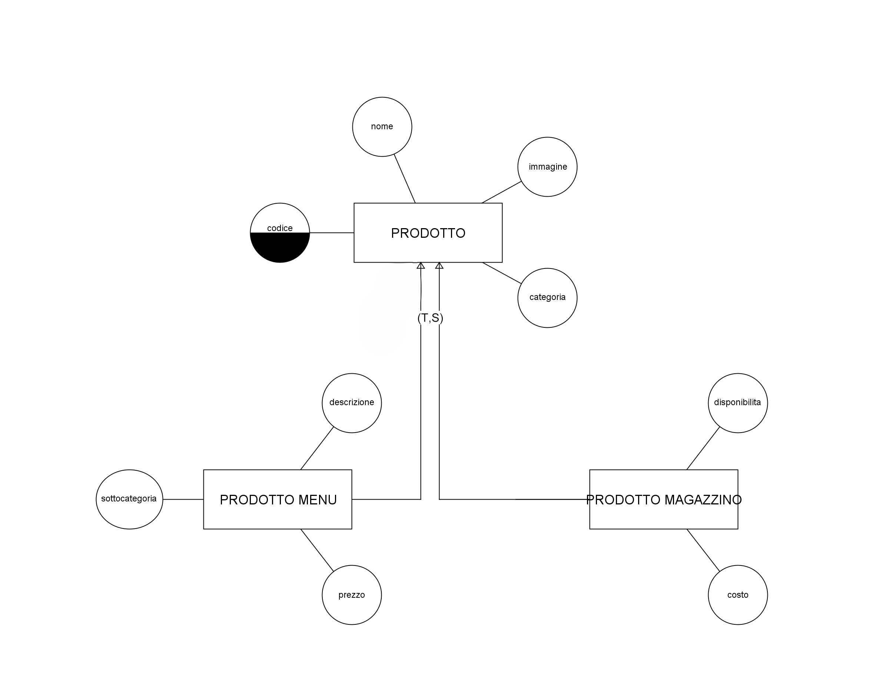
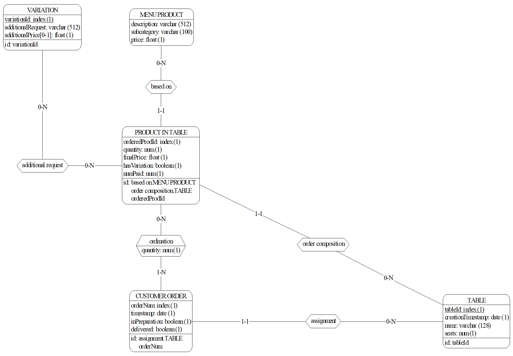
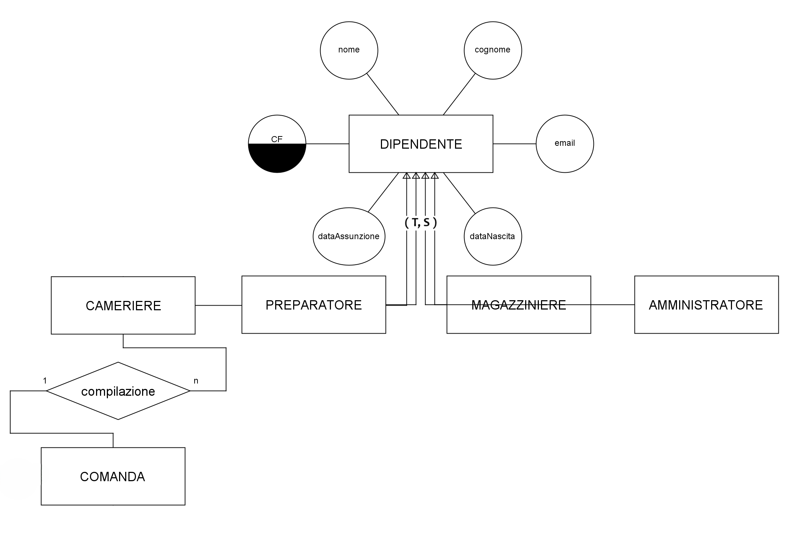
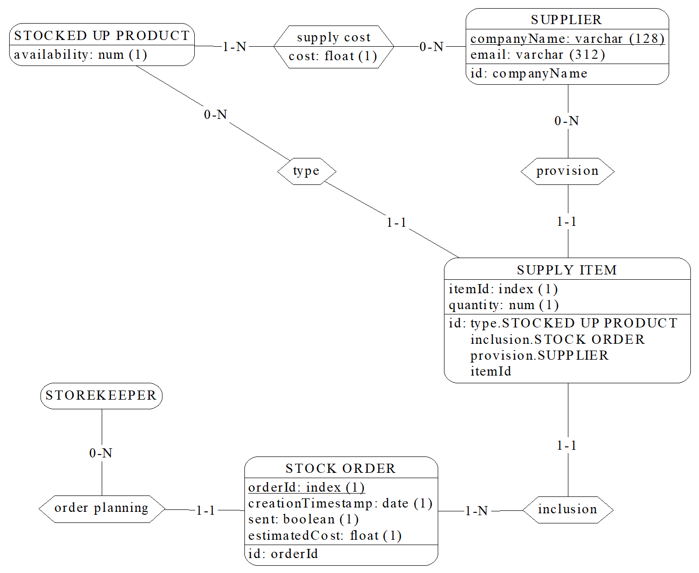

\newcommand{\bluerow}{\rowcolor{RoyalBlue!60}}
\newcommand{\lbluerow}{\rowcolor{RoyalBlue!40}}
\newcommand{\whiterow}{\rowcolor{white}}
\newpage
\tableofcontents
\newpage

# Analisi dei requisiti

Si vuole realizzare un database a supporto dell'automazione della gestione di un esercizio commerciale attivo nella ristorazione (bar/ristoranti). Il databse dovrà quindi memorizzare le informazioni riguardanti i tavoli con le relative comande, prodotti e scontrini. I dipendenti del bar potrenno visualizzare le comande associate ai tavoli e compilare gli scontrini, mentre l'amministratore potrà visualizzare i dati relativi al fatturato.

## Intervista

Un primo testo ottenuto dall’intervista è il seguente:

Si vuole tenere traccia delle comande e della gestione del magazzino di un bar/ristorante memorizzandone i prodotti e le comande. Ogni prodotto è caratterizzato da un nome, una descrizione, un prezzo di vendita o, eventualmente, un prezzo di acquisto per la gestione del magazzino. 

Al momento della creazione di una comanda, vengono registrati i prodotti associati, la quantità di ciascun prodotto e il tavolo a cui la comanda è destinata. I tavoli possono essere identificati sia da un indice numerico sia da un nome scelto al momento (ad esempio "Tavolo 1" o "Tavolo Pippo").

Il sistema permette di redigere uno o più scontrini per ogni tavolo, consentendo di dividere la spesa tra più clienti se necessario. Gli scontrini riportano il prezzo di ogni prodotto e il totale della spesa. Si tenga presente che anche se in futuro si decidesse di eliminare con una certa periodicità lo storico dei tavoli serviti, gli scontrini non devono comunque essere eliminati.

Il database mantiene uno storico di tutti i pagamenti riscossi, consentendo la generazione di grafici per monitorare il fatturato sia annuale che mensile, o l'andamento delle vendite di ciascun prodotto. 

Il bar/ristorante dispone di uno o più amministratori con la possibilità di aggiungere nuovi utenti e visualizzare i dati sul fatturato. Gli utenti possono essere suddivisi nei seguenti ruoli:

- Camerieri: possono redigere le comande per i tavoli.
- Baristi/Cuochi: possono visualizzare le comande in arrivo e segnarle come pronte una volta preparate.
- Magazzinieri: possono stilare la lista dei prodotti presenti in magazzino, annotare i prodotti da ricomprare e gestire il loro prezzo di acquisto.

Ogni comanda viene registrata con la data e l'ora in cui è stata creata e può essere modificata solo da utenti autorizzati fino a quando non viene chiusa con l'emissione di uno scontrino.

Gli amministratori possono anche visualizzare report dettagliati che comprendono:

- Elenco dei prodotti più venduti.
- Analisi del fatturato su base giornaliera, settimanale, mensile e annuale.
- Monitoraggio delle scorte di magazzino, inclusi avvisi per i prodotti che stanno per terminare.

In sintesi, il compito dello staff del bar/ristorante è assicurarsi che le comande vengano redatte e gestite correttamente, che i prodotti siano sempre disponibili in magazzino, e che le vendite e il fatturato vengano monitorati e analizzati per migliorare la gestione complessiva del locale.

\newpage

## Estrazione dei concetti principali

| **Termine**  | **Breve descrizione** | **Eventuali Sinonimi** |
|:-------------|:---------------------:|-----------------------:|
| Prodotto     | Sono gli articoli venduti dall'esercizio, ognuno con un proprio costo |
| Tavolo       | Oggetto a cui è possibile attribuire un nome e una data, rappresenta il gruppo dei clienti a cui si riferiscono comande e scontrini | Clienti |
| Comanda      | Una comanda è un ordine effettuato in un qualsiasi momento dai clienti di un tavolo, contenente uno o più prodotti |
| Scontrino    | Oggetto in cui viene riportata una spesa effettuata da un tavolo, possono esserci uno o più scontrini associati ad un tavolo | Spesa |
| Cameriere    | Colui che compila comande e scontrini | Cassiere |
| Preparatore  | Colui che segna le comande come completate | Cuoco, Bartender |
| Magazziniere | Colui che segna la disponibilità dei prodotti nel magazzino |

## Elaborazione dei concetti principali

A seguito della lettura e comprensione dei requisiti si redige un testo che ne riassuma tutti i concetti, con particolare attenzione a quelli principali ed eliminando le ambiguità:

> Per ogni ***prodotto***[^1] nel menù vengono memorizzati _nome, descrizione, prezzo di vendita_, inoltre ogni prodotto possiede un _codice_ univoco assegnatogli quando viene aggiunto al menù. Se il prodotto è un semplice prodotto da magazzino allora deve riportare anche il proprio _costo_.  
> Ogni ***comanda*** possiede _data e ora_, può essere in preparazione o completata ed ha un _codice univoco_ all'interno del tavolo a cui è collegata. Ad ogni comanda sono associati uno o più prodotti insieme alle _quantità_ richieste. Deve essere possibile verificare che tutti i prodotti appartenenti ad una comanda sono stati pagati.
> Un ***tavolo*** è caratterizzato da: _un codice univoco, un nome (scelto al momento della creazione), un numero di persone_ sedute al tavolo e _una data di creazione_.  
> Uno ***scontrino*** rappresenta la somma dei costi di uno o più prodotti presenti in una comanda associata ad una tavolo, l'insieme degli scontrini erogati in un tavolo rappresenta la spesa totale. Ogni scontrino ha un _codice univoco_ indipendente dal tavolo, _una data e un orario_, _una spesa_ e _una modalità di pagamento_[^2].  
> Lo staff è composto da:

>   - ***amministratori***: hanno la possibilità di aggiungere membri dello staff e visualizzare info sulle vendite
>    - ***preparatori***: preparano le comande e le segnano come completate e aggiornano i prodotti in menu.
>    - ***magazzinieri***: ordinano prodotti del magazzino e ne segnano la disponibilità.
>    - ***camerieri***: aggiungono tavoli e compilano comande e scontrini.

[//]: #Footnotes

[^1]: Un prodotto può essenzialmente essere un prodotto preparato (es: un drink), un prodotto da magazzino (es: farina) oppure entrambi (es: bottiglia di vino).
[^2]: i.e. contante, bancomat...

Segue un elenco delle principali azioni richieste:

1. _Aggiornare prodotti_
2. _Aggiungere tavoli_
3. _Compilare comande_
4. _Mostrare le comande non completate in ordine di arrivo_
5. _Mostare il numero di tavoli e clienti serviti in una sera_
6. _Ricerca prodotti per categorie e sottocategorie_
7. _Ricerca prodotti per nome_
8. _Visualizzare prodotti non pagati in un tavolo_
9. _Compilare scontrini_
10. _Visualizzare i guadagni in un dato periodo_
11. _Compilare ordini del magazzino_
12. _Visualizzare le spese per i rifornimenti in un dato periodo_
13. _Visualizzare le prenotazioni per un dato giorno_
14. _Visualizzare la ricetta di un prodotto_
15. _Aggiornare staff del locale_

\newpage
# Progettazione concettuale

## Schema Scheletro

L'entità ***prodotto*** viene identificata tramite un codice univoco, dall'analisi si evince che ne esistono due tipologie:

- prodotti da magazzino 
- prodotti in menu

 queste tipologie sono specializzazioni _sovrapponibili_ dell'entità prodotto. 

{width=600px}

\newpage
Uno stesso ***prodotto*** può presentarsi nella stessa ***comanda*** con richieste  e quantità differenti (si pensi ad esempio ad una stessa bevanda, nello stesso tavolo, ordinata allo stesso momento, una con ghiaccio, una senza).
E' quindi necessario reificare l'entità _prodotto in comanda_, identificata tramite un ordine nella comanda e il codice della comanda.

Ad ogni comanda corrisponde un ***tavolo***, identificato anch'esso tramite un _codice univoco_. Ad ogni tavolo è possibile assegnare un _nome_ e un _numero di clienti_ seduti.

{width=700px}

\newpage

Le entità ***cameriere, preparatore, amministratore*** e ***magazziniere*** non sono altro che specializzazioni dell'entità ***persona*** (o dipendente), ognuna identificata tramite _codice fiscale_. 
Di ogni dipendente si vuole mantenere nel databse il ruolo all'interno del locale per conoscere le operazioni che possono effettuare (ad esempio la visualizzazione dei dati sul fatturato è un'operazione che spetta esclusivamente ad un amministratore). In particolare per ogni comanda si vuole tenere nel database il cameriere che l'ha compilata.

{width=700}

\newpage
Uno stesso ***prodotto*** può presentarsi in uno stesso ***ordine*** al più una volta, perciò la relazione di _ordinazione_ possiede l'attributo _quantità_ esprimendo il vincolo per il quale le stesse istanze di ordine e prodotto non possono presentarsi con molteplici quantità, creando confusione nell'ordine. Per la _disponibilità_ in magazzino del prodotto si è aggiunto un semplice attributo alla specializzazione ***prodotto in magazzino***.

{width=660}

\newpage
Di seguito si allega lo schema ER nel suo complesso, importato su [DB-Main](www.db-main.eu).

# Progettazione logica

## Stima del volume di dati

Di seguito la stima dei volumi richiesti per entità e relazioni:

[Tabella prod]: #Tabella prodotti

|\bluerow\ **Concetto**       | **Costrutto** | **Volume** |
|:----------------------------|:-------------:|-----------:|
| Menu Product                | E             | 80         |
| Stocked Up Product          | E             | 250        |
| Ingredient                  | R             | 400        |

[Tabella ordini]: #Tabella ordini, tavoli, scontrini e prenotazioni

|\bluerow\ **Concetto** | **Costrutto** |  **Volume**|
|:----------------------|:-------------:|-----------:|
| based on              | R             | 400.000    |
| Ordered Product       | E             | 400.000    |
| Paid Product          | E             | 1.000.000  |
| is                    | R             | 1.000.000  |
| has                   | R             | 1.000.000  |
| Receipt               | E             | 640.000    |
| Customer Order        | E             | 100.000    |
| assignment            | R             | 100.000    |
| order composition     | R             | 400.000    |
| Table                 | E             | 30.000     |
| payment               | R             | 600.000    |
| Reservation           | E             | 5.000      |
| request               | R             | 5.000      |

[Tabella magazzino]: #Tabella ordini di magazzino

|\bluerow\  **Concetto**       | **Costrutto** | **Volume** |
|:-----------------------------|:-------------:|-----------:|
| Supplier                     | E             | 10         |
| supply                       | R             | 750        |
| provision                    | R             | 10.000     |
| type                         | R             | 10.000     |
| Supply Item                  | E             | 10.000     |
| inclusion                    | R             | 10.000     |
| Stock Order                  | E             | 1.000      |

[//Tabella dipendenti]: #Tabella dei dipendenti

|\bluerow\ **Concetto**       | **Costrutto** | **Volume** |
|:----------------------------|:-------------:|-----------:|
| Waiter                      | E             | 25         |
| order compilation           | R             | 100.000    |
| Kitchen Staff               | E             | 25         |
| Admin                       | E             | 5          |
| Storekeeper                 | E             | 10         |
| order planning              | R             | 1.000      |

## Descrizione delle operazioni principali e stima della loro frequenza

Le operazioni da effettuare sono quelle precedentemente elencate nella fase di analisi. Di seguito vengono elencate insieme alla relativa frequenza:

|\bluerow\ **Numero operazione**  | **Operazione**                                              | **Frequenza**      |
|:--------------------------------|:------------------------------------------------------------|-------------------:|
| 1.                              | Aggiornare prodotti                                         | 50 all'anno        |
| 2.                              | Aggiungere tavoli                                           | 200 a settimana    |
| 3.                              | Compilare comande                                           | 800 a settimana    |
| 4.                              | Mostrare le comande non completate in ordine di arrivo      | 30 al giorno       |
| 5.                              | Mostare il numero di tavoli e clienti serviti in una sera   | 2 al giorno        |
| 6.                              | Ricerca prodotti per categorie e sottocategorie             | 10 al giorno       |
| 7.                              | Ricerca prodotti per nome                                   | 4000 a settimana   |
| 8.                              | Visualizzare prodotti non pagati in un tavolo               | 2400 a settimana   |
| 9.                              | Compilare scontrini                                         | 600 a settimana    |
| 10.                             | Visualizzare i guadagni in un dato periodo                  | 10 al mese         |
| 11.                             | Compilare ordini del magazzino                              | 3 a settimana      |
| 12.                             | Visualizzare le spese per i rifornimenti in un dato periodo | 10 al mese         |
| 13.                             | Visualizzare le prenotazioni per un dato giorno             | 100 a settimana    |
| 14.                             | Visualizzare la ricetta di un prodotto                      | 20 al giorno       |
| 15.                             | Aggiornare staff del locale                                 | 5 all'anno         |

## Schemi di navigazione e tabelle degli accessi

Sono riportate in seguito le tabelle degli accessi delle operazioni elencate sopra. Per il calcolo dei costi le operazioni in scrittura sono considerate con peso doppio rispetto a quelle in lettura.

### Operazione 1 - Aggiornare prodotti

L'aggiornamento di un _prodotto_ comporta anche l'aggiornamento della ricetta, possiamo considerare che in media ogni prodotto ha 3 _ingredienti_ e ogni _prodotto di magazzino_ è _ingrediente_ di 3 _prodotti da menù_.

| \bluerow\ **Concetto** | **Costrutto** | **Accessi** | **Tipo** |
|:----------------------:|:-------------:|:-----------:|---------:|
| Product                | E             | 1           | L        |
| Product                | E             | 1           | S        |
| Ingredient             | R             | 3           | L        |
| Ingredient             | R             | 3           | S        |
| \lbluerow              | **Totale:**   | 4S + 4L → 500 all'anno |

### Operazione 2 - Aggiungere Tavoli

| \bluerow\ **Concetto** | **Costrutto** | **Accessi** | **Tipo** |
|:----------------------:|:-------------:|:-----------:|---------:|
| Table                  | E             | 1           | S        |
| \lbluerow              | **Totale:**   | 1S → 600 a settimana   |

### Operazione 3 - Compilare Comande

La compilazione delle _comande_ richiede delle ricerche di _prodotti di menu_, quindi degli _accessi in lettura_, che in media sono 5 a comanda.

| \bluerow\ **Concetto** | **Costrutto** | **Accessi** | **Tipo** |
|:----------------------:|:-------------:|:-----------:|---------:|
| Menu Product           | E             | 5           | L        |
| Customer Order         | E             | 1           | S        |
| \lbluerow              | **Totale:**   | 1S + 5L → 5600 all'anno|

### Operazione 4 - Mostrare le comande non completate in ordine di arrivo

| \bluerow\ **Concetto** | **Costrutto** | **Accessi** | **Tipo** |
|:----------------------:|:-------------:|:-----------:|---------:|
| \whiterow\ Customer Order | E          | 1           | L        |
| \lbluerow              | **Totale:**   | 1L → 30 al giorno      |

### Operazione 5 - Mostrare il numero di tavoli e clienti serviti in una sera

| \bluerow\ **Concetto** | **Costrutto** | **Accessi** | **Tipo** |
|:----------------------:|:-------------:|:-----------:|---------:|
| \whiterow\ Table       | E             | 1           | L        |
| \lbluerow              | **Totale:**   | 1L → 2 al giorno       |

### Operazione 6 - Ricerca prodotti per categorie e sottocategorie

| \bluerow\ **Concetto** | **Costrutto** | **Accessi** | **Tipo** |
|:----------------------:|:-------------:|:-----------:|---------:|
| \whiterow\ Menu Product | E            | 1           | L        |
| \lbluerow              | **Totale:**   | 1L → 10 al giorno      |

### Operazione 7 - Ricerca prodotti per nome

| \bluerow\ **Concetto** | **Costrutto** | **Accessi** | **Tipo** |
|:----------------------:|:-------------:|:-----------:|---------:|
| \whiterow\ Menu Product | E            | 1           | L        |
| \lbluerow              | **Totale:**   | 1L → 4000 a settimana  |

### Operazione 8 - Visualizzare prodotti non pagati in un tavolo

Per visualizzare i prodotti non pagati è sufficiente accedere prima al _tavolo_ e successivamente ai _prodotti ordinati_, che in media in un _tavolo_ sono 5.

| \bluerow\ **Concetto** | **Costrutto** | **Accessi** | **Tipo** |
|:----------------------:|:-------------:|:-----------:|---------:|
| Table                  | E             | 1           | L        |
| Ordered Product        | E             | 5           | L        |
| \lbluerow              | **Totale:**   | 6L → 14.400 a settimana|

### Operazione 9 - Compilare scontrini

Per compilare uno _scontrino_ è necessario innazitutto una _visualizzazione dei prodotti non pagati in un tavolo_. Successivamente è necessario leggerne il _prezzo_ dai relativi _prodotti in menu_ e successivamente aggiungere dei _prodotti pagati_, in media 2 per _scontrino_, e aggiornare l'attributo _numPaid_ nei relativi _prodotti ordinati_.

| \bluerow\ **Concetto** | **Costrutto** | **Accessi** | **Tipo** |
|:----------------------:|:-------------:|:-----------:|---------:|
| Receipt                | E             | 1           | S        |
| Table                  | E             | 1           | L        |
| Ordered Product        | E             | 5           | L        |
| Menu Product           | E             | 2           | L        |
| Paid Product           | E             | 2           | S        |
| Ordered Product        | E             | 2           | S        |
| \lbluerow              | **Totale:**   | 5S + 8L → 10.800 a settimana |

### Operazione 10 - Visualizzare i guadagni in un dato periodo

E' sufficiente accedere ai dati dei pagamenti degli _scontrini_.

| \bluerow\ **Concetto** | **Costrutto** | **Accessi** | **Tipo** |
|:----------------------:|:-------------:|:-----------:|---------:|
| \whiterow\ Receipt     | E             | 1           | L        |
| \lbluerow              | **Totale:**   | 1L → 10 al mese        |

### Operazione 11 - Compilare gli ordini del magazzino

Per compilare un _ordine di magazzino_ è necessario accedere ai _prodotti di magazzino_, in media 20 per ordine, scegliere il _fornitore_, in media sono 4, confrontando il _costo_.
Occorre poi creare gli _elementi di fornitura_ con le quantità scelte.

| \bluerow\ **Concetto** | **Costrutto** | **Accessi** | **Tipo** |
|:----------------------:|:-------------:|:-----------:|---------:|
| Stocked Up Product     | E             | 20          | L        |
| supply                 | R             | 4           | L        |
| Supply Item            | E             | 20          | S        |
| Supply Item            | E             | 20          | L        |
| Stock Order            | E             | 1           | S        |
| \lbluerow              | **Totale:**   | 21S + 44L → 258 a settimana |

### Operazione 12 - Visualizzare le spese per i rifornimenti in un dato periodo

Considerando come riferimento una settimana[^3]:

[^3]: Ci si attiene alle stime fatte precedentemente, che erano su base settimanale. Il costo può essere moltiplicato per trovare la stima mensile e/o annuale.
[^4]: Se si volesse ottenere il costo di una lettura su base mensile fatta 3 volte a settimana il costo diventerebbe:  
        _Totale = 63L * 4 * 3 = 756 a settimana_

| \bluerow\ **Concetto** | **Costrutto** | **Accessi** | **Tipo** |
|:----------------------:|:-------------:|:-----------:|---------:|
| Stock Order            | E             | 3           | L        |
| Supply Item            | E             | 60          | L        |
| \lbluerow              | **Totale:**   | 63L[^4] →     189 a settimana |

### Operazione 13 - Visualizzare le prenotazioni per un dato giorno

Si possono considerare in media 5 prenotazioni al giorno, per ogni prenotazione si vuole visualizzare il _tavolo_ previsto se esiste.

| \bluerow\ **Concetto** | **Costrutto** | **Accessi** | **Tipo** |
|:----------------------:|:-------------:|:-----------:|---------:|
| Prenotation            | E             | 1           | L        |
| Table                  | E             | 1           | L        |
| \lbluerow              | **Totale:**   | 2L → 200 a settimana   |

### Operazione 14 - Visualizzare la ricetta di un prodotto

Per ogni _prodotto in menu_ consideriamo una media di 3 _ingredienti_, come già fatto in precedenza.

| \bluerow\ **Concetto** | **Costrutto** | **Accessi** | **Tipo** |
|:----------------------:|:-------------:|:-----------:|---------:|
| Menu Product           | E             | 1           | L        |
| Stocked Up Product     | E             | 3           | L        |
| \lbluerow              | **Totale:**   | 4L → 80 al giorno      |

### Operazione 15 - Aggiornare staff del locale

| \bluerow\ **Concetto** | **Costrutto** | **Accessi** | **Tipo** |
|:----------------------:|:-------------:|:-----------:|---------:|
| Employee               | E             | 1           | S        |
| \lbluerow              | **Totale:**   | 1S → 10 all'anno       |

