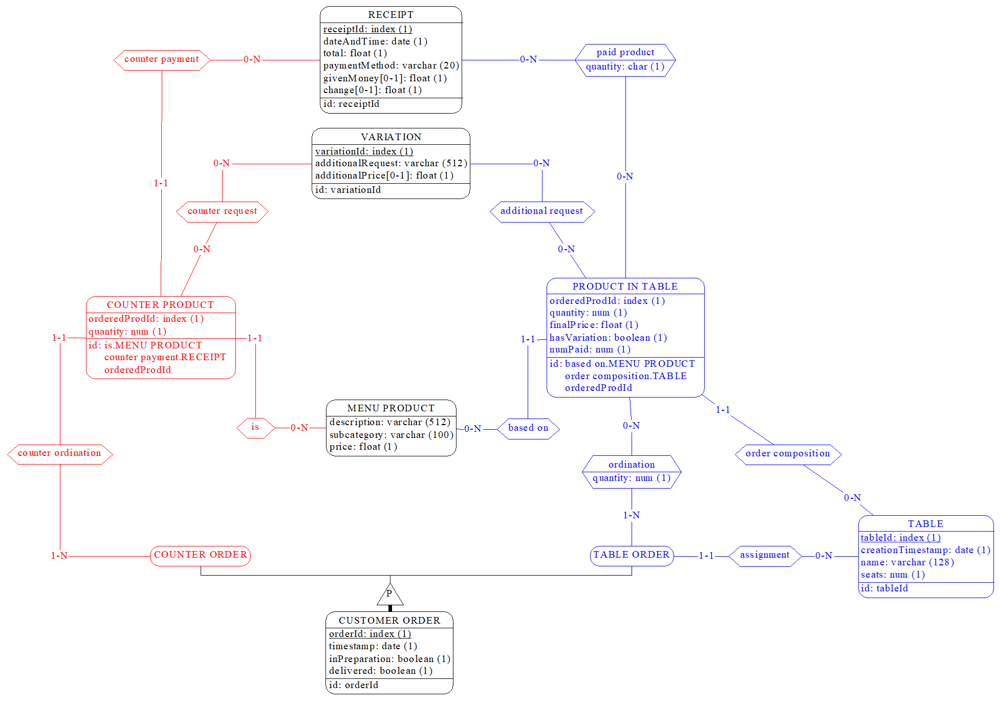
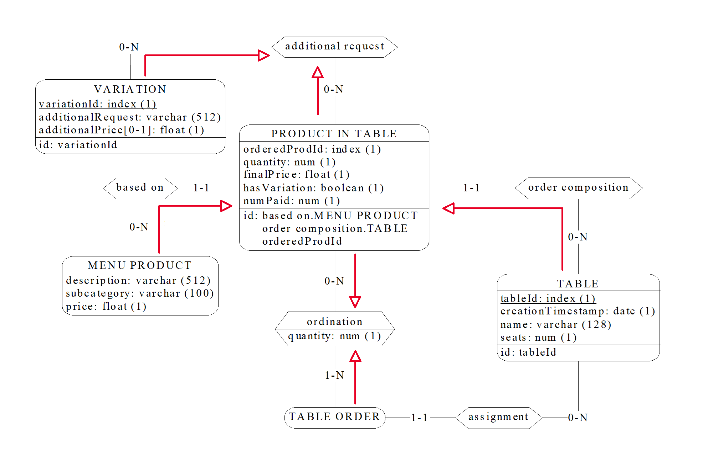
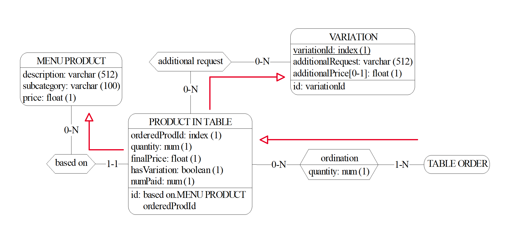
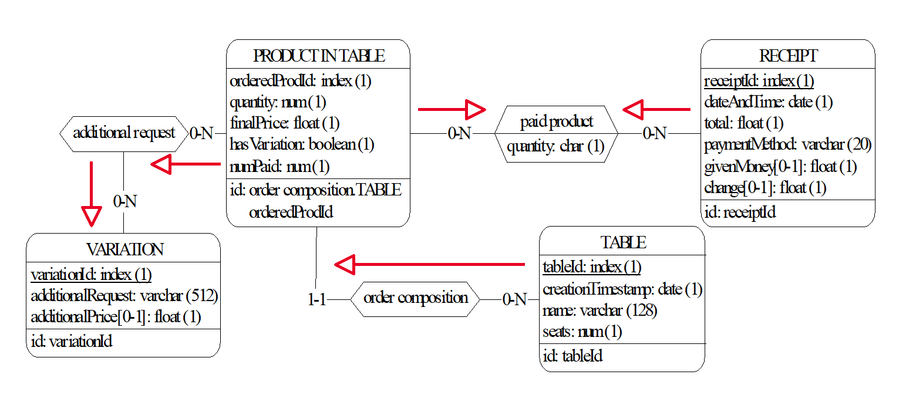
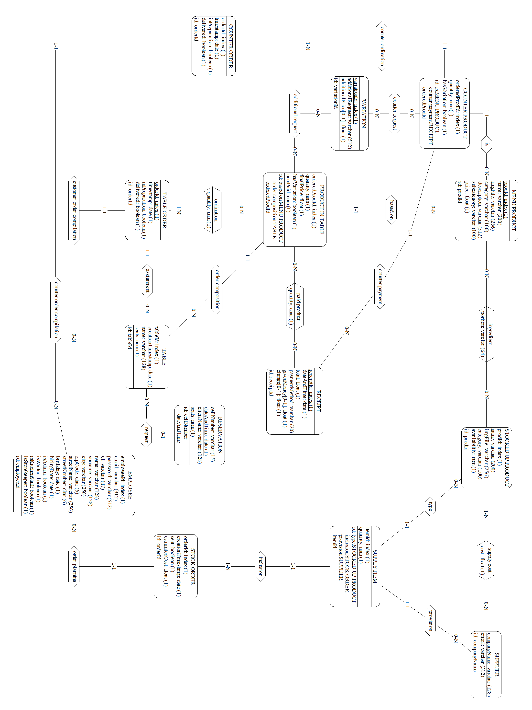
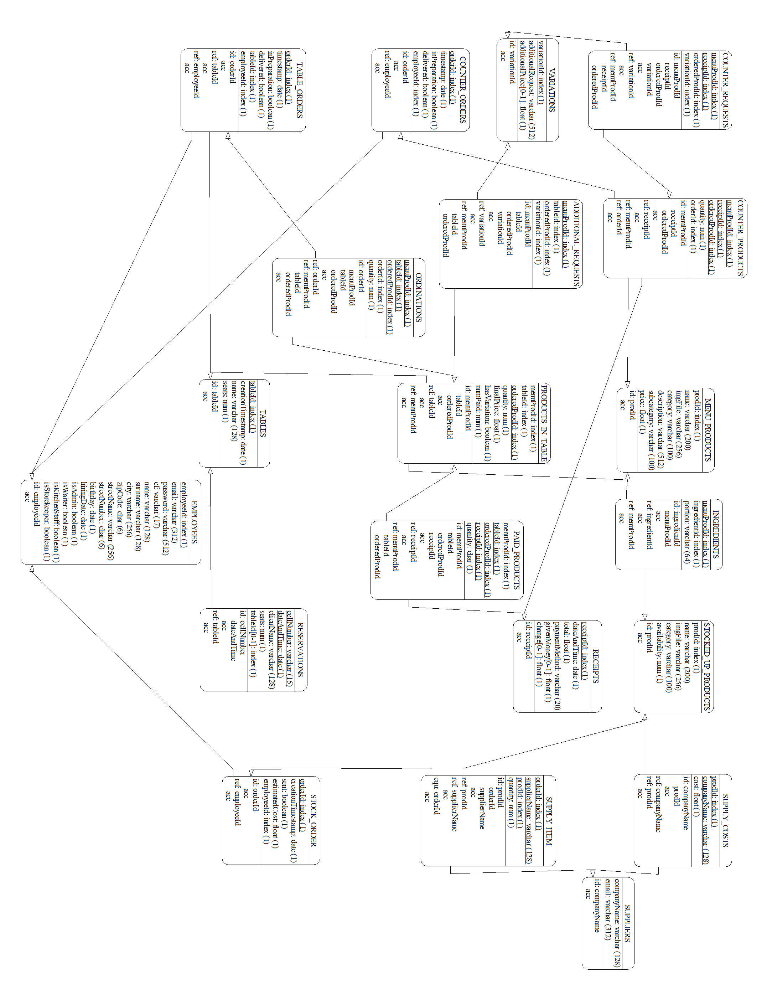
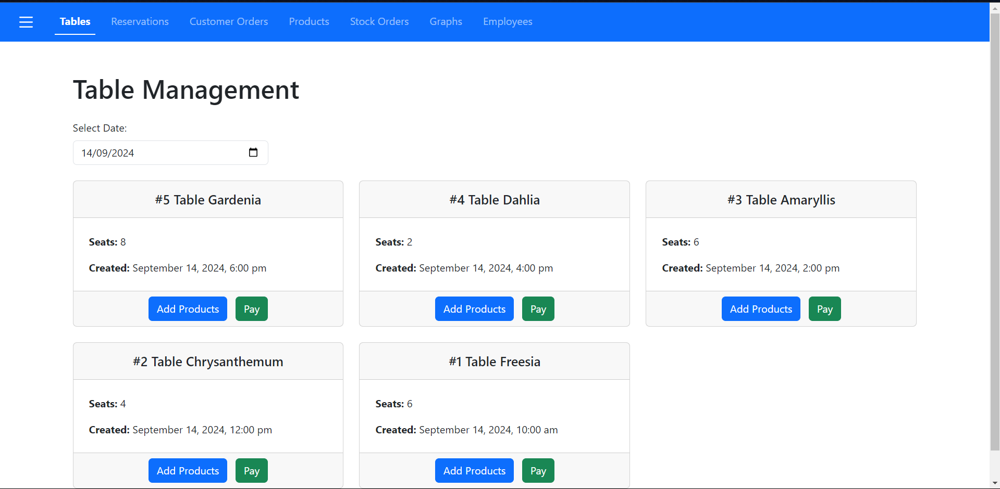
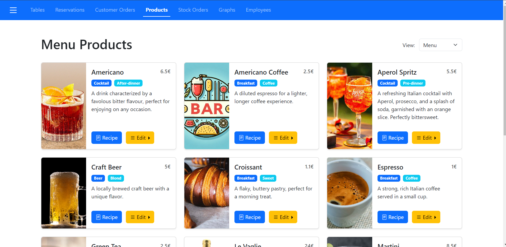
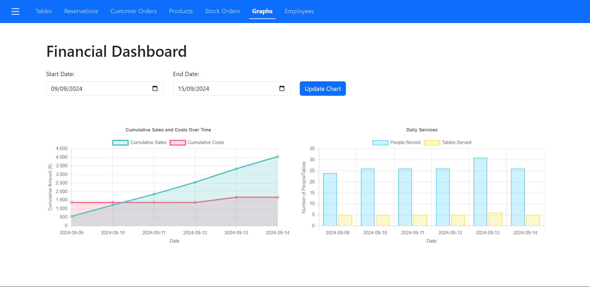

\newcommand{\bluerow}{\rowcolor{RoyalBlue!60}}
\newcommand{\lbluerow}{\rowcolor{RoyalBlue!40}}
\newcommand{\whiterow}{\rowcolor{white}}
\newcommand{\redrow}{\rowcolor{BrickRed!60}}
\newcommand{\lredrow}{\rowcolor{BrickRed!40}}
\newcommand{\llredrow}{\rowcolor{BrickRed!15}}
\newcommand{\und}[1]{\underline{#1}}

\newpage
\tableofcontents
\newpage

# Analisi dei requisiti

Si vuole realizzare un database a supporto dell'automazione della gestione di un esercizio commerciale attivo nella ristorazione (bar/ristoranti). Il databse dovrà quindi memorizzare le informazioni riguardanti i tavoli con le relative comande, prodotti e scontrini. I dipendenti del bar potrenno visualizzare le comande associate ai tavoli e compilare gli scontrini, mentre l'amministratore potrà visualizzare i dati relativi al fatturato.

## Intervista

Un primo testo ottenuto dall’intervista è il seguente:

Si vuole tenere traccia delle comande e della gestione del magazzino di un bar/ristorante memorizzandone i prodotti e le comande. Ogni prodotto è caratterizzato da un nome, una descrizione, un prezzo di vendita o, eventualmente, un prezzo di acquisto per la gestione del magazzino.

Al momento della creazione di una comanda, vengono registrati i prodotti associati, la quantità di ciascun prodotto e il tavolo a cui la comanda è destinata. Ai tavoli è possibile attribuire un nome scelto al momento (ad esempio "Tavolo Sala 1" o "Tavolo Pippo").

Il sistema permette di redigere uno o più scontrini per ogni tavolo, consentendo di dividere la spesa tra più clienti se necessario. Gli scontrini riportano il prezzo di ogni prodotto e il totale della spesa. Si tenga presente che uno scontrino non si riferisce necessariamente ad un tavolo, un ordine può anche essere fettuato al tavolo e in quel caso necessita il pagamento al momento dell'ordine.

Il database mantiene uno storico di tutti i pagamenti riscossi, consentendo la generazione di grafici per monitorare il fatturato sia annuale che mensile, o l'andamento delle vendite di ciascun prodotto.

Il bar/ristorante dispone di uno o più amministratori con la possibilità di aggiungere nuovi utenti e visualizzare i dati sul fatturato. Gli utenti possono essere suddivisi nei seguenti ruoli:

- Camerieri: possono redigere le comande per i tavoli.
- Baristi/Cuochi: possono visualizzare le comande in arrivo e segnarle come pronte una volta preparate.
- Magazzinieri: possono stilare la lista dei prodotti presenti in magazzino, annotare i prodotti da ricomprare e gestire il loro prezzo di acquisto.

Ogni comanda viene registrata con la data e l'ora in cui è stata creata e può essere modificata solo da utenti autorizzati fino a quando non viene chiusa con l'emissione di uno scontrino.

Gli amministratori possono anche visualizzare report dettagliati che comprendono:

- Elenco dei prodotti più venduti.
- Analisi del fatturato su base giornaliera, settimanale, mensile e annuale.
- Analisi dei servizi effettuati: persone e tavoli serviti

In sintesi, il compito dello staff del bar/ristorante è assicurarsi che le comande vengano redatte e gestite correttamente, che i prodotti siano sempre disponibili in magazzino, e che le vendite e il fatturato vengano monitorati e analizzati per migliorare la gestione complessiva del locale.

\newpage

## Estrazione dei concetti principali

| \bluerow\ **Termine** |                                                        **Breve descrizione**                                                        |
| :-------------------- | :---------------------------------------------------------------------------------------------------------------------------------: |
| Prodotto              |                                Sono gli articoli venduti dall'esercizio, ognuno con un proprio costo                                |
| Tavolo                | Oggetto a cui è possibile attribuire un nome e una data, rappresenta il gruppo dei clienti a cui si riferiscono comande e scontrini |
| Comanda               |                Una comanda è un ordine effettuato in un qualsiasi momento dai clienti contenente uno o più prodotti                 |
| Scontrino             |    Oggetto in cui viene riportata una spesa effettuata da un tavolo, possono esserci uno o più scontrini associati ad un tavolo     |
| Cameriere             |                                                Colui che compila comande e scontrini                                                |
| Preparatore           |                                             Colui che segna le comande come completate                                              |
| Magazziniere          |                                     Colui che segna la disponibilità dei prodotti nel magazzino                                     |
| Amministratore        |                                Colui che gestisce visualizza dati finanziari e modifica i dipendenti                                |

## Elaborazione dei concetti principali

A seguito della lettura e comprensione dei requisiti si redige un testo che ne riassuma tutti i concetti, con particolare attenzione a quelli principali ed eliminando le ambiguità:

> Per ogni **_prodotto_**[^1] nel menù vengono memorizzati _nome, descrizione, prezzo di vendita_, inoltre ogni prodotto possiede un _codice_ univoco assegnatogli quando viene aggiunto al menù. Se il prodotto è un semplice prodotto da magazzino allora deve riportare anche il proprio _costo_. Per ogni prodotto è possibile memorizzare una _ricetta_ composta da _ingredienti_ e _quantità_ necessarie per la preparazione.
> Ogni **_comanda_** possiede _data e ora_, può essere in preparazione o completata ed ha un _codice univoco_, le comande possono riguardare _ordini al banco_ oppure _ordini al tavolo_. Ad ogni comanda sono associati uno o più prodotti insieme alle _quantità_ richieste. Deve essere possibile verificare che tutti i prodotti appartenenti ad una comanda sono stati pagati. Ogni prodotto, che sia ordinato al tavolo o al banco, può presentare una o più _richieste aggiuntive_ del cliente, che potrebbero comportare un _costo aggiuntivo_.
> Un **_tavolo_** è caratterizzato da: _un codice univoco, un nome (scelto al momento della creazione), un numero di persone_ sedute al tavolo e _una data di creazione_.  
> Uno **_scontrino_** rappresenta la somma dei costi di uno o più prodotti presenti in una comanda associata ad una tavolo, l'insieme degli scontrini erogati in un tavolo rappresenta la spesa totale. Ogni scontrino ha un _codice univoco_ indipendente dal tavolo, _una data e un orario_, _una spesa_ e _una modalità di pagamento_[^2], per ogni scontrino deve essere possibile elencare i prodotti che lo componevano e le relative quantità.
> Un **_ordine di magazzino_** è caratterizzato da _un codice univoco e una data e orario_. Per ogni ordine si tiene conto del _dipendente_ che lo ha compilato e dei prodotti che lo compongono. Per ogni prodotto è possibile scegliere un **_fornitore_** (identificato attraverso un _nome_) avente ognuno un _costo_ potenzialmente differente per ogni prodotto.
> Lo staff è composto da:

> - **_amministratori_**: hanno la possibilità di aggiungere membri dello staff e visualizzare info sulle vendite
> - **_preparatori_**: preparano le comande e le segnano come completate e aggiornano i prodotti in menu.
> - **_magazzinieri_**: ordinano prodotti del magazzino e ne segnano la disponibilità.
> - **_camerieri_**: aggiungono tavoli e compilano comande e scontrini.

[//]: #Footnotes

[^1]: Un prodotto può essenzialmente essere un prodotto preparato (es: un drink), un prodotto da magazzino (es: farina) oppure entrambi (es: bottiglia di vino).
[^2]: i.e. contante, bancomat...

Segue un elenco delle principali azioni richieste:

1. _Aggiornare prodotti_
2. _Aggiungere tavoli_
3. _Compilare comande al tavolo_
4. _Mostrare le comande filtrate per stato e numerate per giornata_
5. _Mostare il numero di tavoli e clienti serviti in un dato periodo_
6. _Visualizzare prodotti e relative variazioni appartenenti ad una comanda_
7. _Ricerca prodotti per similitudine di nome, categoria e sottocategoria_
8. _Visualizzare prodotti non pagati in un tavolo_
9. _Compilare scontrini di un tavolo_
10. _Visualizzare i guadagni in un dato periodo_
11. _Compilare ordini del magazzino_
12. _Visualizzare le spese per i rifornimenti in un dato periodo_
13. _Visualizzare le prenotazioni per un dato giorno_
14. _Visualizzare la ricetta di un prodotto_
15. _Aggiornare staff del locale_

\newpage

# Progettazione concettuale

## Schema Scheletro

L'entità **_prodotto_** viene identificata tramite un codice univoco, dall'analisi si evince che ne esistono due tipologie:

- prodotti da magazzino
- prodotti in menu

queste tipologie sono specializzazioni _sovrapponibili_ dell'entità prodotto.

{height=300px}

\newpage

Ogni comanda si riferisce ad un **_tavolo_**, se ordinata da esso, altrimenti allo **_scontrino_** tramite cui è stata pagata, anch'essi identificati tramite un _codice univoco_. Ad ogni tavolo è possibile assegnare un _nome_ e un _numero di clienti_ seduti.

Uno stesso **_prodotto_** può presentarsi nella stessa **_comanda_** con **_variazioni_** e quantità differenti (si pensi ad esempio ad una stessa bevanda, nello stesso tavolo, ordinata allo stesso momento, una con ghiaccio, una senza).
E' quindi necessario reificare le entità **_prodotto al tavolo_** e **_prodotto al banco_**, identificate tramite un _id univoci_ e riportanti la \*\*quantità ordinata.

Ad ogni prodotto al tavolo è possibile associare una variazione ed una quantità associata alla comanda. Ogni prodotto del tavolo può essere presente una sola volta nella stessa comanda, perciò è possibile creare un'associazione con la comanda e l'attributo _quantità_. Tale associazione esprime il vincolo per il quale le stesse istanze di ordine al tavolo e prodotto non possono presentarsi con molteplici quantità.

I prodotti al banco sono invece prodotti ordinati senza riferimento ad un tavolo, non hanno perciò associazioni con esso, inoltre non hanno bisogno di un attributo _quantità_ nell'associazione con comanda, in quanto per un prodotto al banco la quantità in comanda corrisponde alla quantità ordinata.

{width=700px}

\newpage
Le entità **_cameriere, preparatore, amministratore_** e **_magazziniere_** non sono altro che specializzazioni dell'entità **_dipendente_**, ognuna identificata tramite _id univoco_.
Di ogni dipendente si vuole mantenere nel database il ruolo all'interno del locale per conoscere le operazioni che possono effettuare (ad esempio la visualizzazione dei dati sul fatturato è un'operazione che spetta esclusivamente ad un amministratore). In particolare per ogni comanda e per ogni ordine di magazzino si vuole tenere nel database rispettivamente il cameriere e l'addetto al magazzino che li hanno compilati.

\newpage
Uno stesso **_prodotto_** può essere incluso in uno stesso **_ordine di magazzino_**, identificato tramite un _codice univoco_, più volte, ordinato ad esempio da **_fornitori_** diversi, ognuno con un _prezzo_ potenzialmente diverso per lo stesso prodotto. E' quindi necessario reificare l'entità di **_prodotto in ordine_**, avente come attributi la _quantità ordinata, un'id univoco nell'ordine_ e un'associazione al fornitore scelto.

Dell'ordine di magazzino è inoltre necessario tenere traccia nel database della _data e ora_ dell'ordine, se l'ordine è già stato inviato e il dipendente che lo ha compilato.

{width=500px}

\newpage
Ogni **_prodotto al tavolo_** può essere pagato in più scontrini in quantità differenti e con _modalità di pagamento differenti_, tuttavia uno stesso prodotto al tavolo non può essere presente in più scontrini, è quindi sufficiente un'associazione tra prodotto al tavolo e scontrino, con l'attributo _quantità pagata_. Tale associazione esprime il vincolo per il quale le stesse istanze di prodotto al tavolo non possono presentarsi con moltepliche quantità pagate in uno stesso scontrino

Ogni **_prodotto al banco_** è un prodotto ordinato senza riferimento ad un tavolo, è identificato attraverso un _id_ univoco all'interno dello scontrino cui si riferisce. Ogni prodotto al banco deve essere interamente pagato al momento dell'ordine, perciò è sufficiente un'associazione tra prodotto al banco e scontrino, senza necessità di un attributo quantità pagata.

Ogni **_scontrino_** è identificato da un _codice univoco_, ha una _data e un orario_, una _spesa_ e una _modalità di pagamento_.

{width=660}

\newpage

## Schema ER completo

Di seguito si allega lo schema ER nel suo complesso, costruito con [DB-Main](www.db-main.eu).

{height=1100px}

\newpage

# Progettazione logica

## Stima del volume di dati

Di seguito la stima dei volumi richiesti per entità e relazioni:

[Tabella prod]: #Tabella prodotti

| \bluerow\ **Concetto** | **Costrutto** |  **Volume** |
| :--------------------- | :-----------: | ----------: |
| Menu Product           |       E       |          80 |
| Stocked Up Product     |       E       |         250 |
| Ingredient             |       R       |     320[^3] |
| Variation              |       E       |         500 |
| counter request        |       E       |     750.000 |
| additional request     |       R       | 750.000[^4] |

[^3]: Considerando una media di 4 ingredienti per prodotto in menu
[^4]: Considerando circa 5 diversi prodotti ordinati in un tavolo

[Tabella ordini]: #Tabella ordini, tavoli, scontrini e prenotazioni

| \bluerow\ **Concetto** | **Costrutto** |    **Volume** |
| :--------------------- | :-----------: | ------------: |
| Table                  |       E       |       150.000 |
| Product In Table       |       E       |   750.000[^5] |
| Counter Product        |       E       |       750.000 |
| counter ordination     |       E       |       750.000 |
| Table Order            |       E       |   300.000[^6] |
| Counter Order          |       E       |       300.000 |
| ordination             |       R       |       750.000 |
| based on               |       R       |       750.000 |
| Receipt                |       E       |   600.000[^7] |
| paid product           |       E       | 1.000.000[^8] |
| counter payment        |       R       |       750.000 |
| order composition      |       R       |       750.000 |
| assignment             |       R       |       300.000 |
| Reservation            |       E       |         5.000 |
| request                |       R       |         5.000 |

[^5]: Considerando circa 2 comande per tavolo
[^6]: Considerando che ogni prodotto ordinato presenta una variazione
[^7]: Considerando circa 2 scontrini per tavolo + 1 scontrino per ogni ordine al banco
[^8]: Considerando che per ogni prodotto al tavolo deve esistere almeno un corrispondente prodotto pagato e che alcuni potrebbero essere pagati in scontrini diversi

[Tabella magazzino]: #Tabella ordini di magazzino

| \bluerow\ **Concetto** | **Costrutto** | **Volume** |
| :--------------------- | :-----------: | ---------: |
| Supplier               |       E       |         10 |
| supply cost            |       R       |        750 |
| provision              |       R       |     10.000 |
| type                   |       R       |     10.000 |
| Supply Item            |       E       |     10.000 |
| inclusion              |       R       |     10.000 |
| Stock Order            |       E       |      1.000 |

[//Tabella dipendenti]: #Tabella dei dipendenti

| \bluerow\ **Concetto** | **Costrutto** | **Volume** |
| :--------------------- | :-----------: | ---------: |
| Waiter                 |       E       |         25 |
| order compilation      |       R       |    300.000 |
| Kitchen Staff          |       E       |         25 |
| Admin                  |       E       |          5 |
| Storekeeper            |       E       |         10 |
| order planning         |       R       |      1.000 |

## Descrizione delle operazioni principali e stima della loro frequenza

Le operazioni da effettuare sono quelle precedentemente elencate nella fase di analisi. Di seguito vengono elencate insieme alla relativa frequenza:

| \bluerow\ **Numero operazione** | **Operazione**                                                | **Frequenza**    |
| :------------------------------ | :------------------------------------------------------------ | :--------------- |
| 1.                              | Aggiornare prodotti                                           | 50 all'anno      |
| 2.                              | Aggiungere tavoli                                             | 200 a settimana  |
| 3.                              | Compilare comande al tavolo                                   | 800 a settimana  |
| 4.                              | Mostrare comande filtrate per stato e numerate per giornata   | 30 al giorno     |
| 5.                              | Mostare numero tavoli e clienti serviti in un dato periodo    | 2 al giorno      |
| 6.                              | Visualizzare prodotti e variazioni nella comanda di un tavolo | 100 al giorno    |
| 7.                              | Ricerca prodotti per pattern nome, categoria e sottocategoria | 4000 a settimana |
| 8.                              | Visualizzare prodotti non pagati in un tavolo                 | 2400 a settimana |
| 9.                              | Compilare scontrini di un tavolo                              | 600 a settimana  |
| 10.                             | Visualizzare i guadagni in un dato periodo                    | 10 al mese       |
| 11.                             | Compilare ordini del magazzino                                | 3 a settimana    |
| 12.                             | Visualizzare spese per rifornimenti in un dato periodo        | 10 al mese       |
| 13.                             | Visualizzare le prenotazioni per un dato giorno               | 100 a settimana  |
| 14.                             | Visualizzare la ricetta di un prodotto                        | 20 al giorno     |
| 15.                             | Aggiornare staff del locale                                   | 5 all'anno       |

## Schemi di navigazione e tabelle degli accessi

Sono riportate in seguito le tabelle degli accessi delle operazioni elencate sopra. Per il calcolo dei costi le operazioni in scrittura sono considerate con peso doppio rispetto a quelle in lettura.

### Operazione 1 - Aggiornare prodotti

L'aggiornamento di un _prodotto_ comporta anche l'aggiornamento della ricetta, possiamo considerare che in media ogni prodotto ha 3 _ingredienti_ e ogni _prodotto di magazzino_ è _ingrediente_ di 3 _prodotti da menù_.

| \bluerow\ **Concetto** | **Costrutto** |      **Accessi**       | **Tipo** |
| :--------------------: | :-----------: | :--------------------: | -------: |
|        Product         |       E       |           1            |        L |
|        Product         |       E       |           1            |        S |
|       Ingredient       |       R       |           3            |        L |
|       Ingredient       |       R       |           3            |        S |
|       \lbluerow        |  **Totale:**  | 4S + 4L → 500 all'anno |

### Operazione 2 - Aggiungere Tavoli

| \bluerow\ **Concetto** | **Costrutto** |     **Accessi**      | **Tipo** |
| :--------------------: | :-----------: | :------------------: | -------: |
|         Table          |       E       |          1           |        S |
|       \lbluerow        |  **Totale:**  | 1S → 400 a settimana |

### Operazione 3 - Compilare Comande al tavolo

{width=400px}

La compilazione delle _comande_ richiede delle ricerche di _prodotti di menu_, che in media sono 3 a comanda, successivamente occorrono degli accessi in lettura alle _variazioni_, degli aggiornamenti nei _prodotti al tavolo_ e degli accessi in scrittura nelle _richieste aggiuntive_. Consideriamo inoltre 1 sola scrittura di _order composition_, in quanto gli altri prodotti potrebbero già essere scritti.

| \bluerow\ **Concetto** | **Costrutto** |          **Accessi**           | **Tipo** |
| :--------------------- | :-----------: | :----------------------------: | -------: |
| Menu Product           |       E       |               3                |        L |
| based on               |       R       |               3                |        L |
| Variation              |       E       |               3                |        L |
| additional request     |       R       |               3                |        S |
| Product In Table       |       E       |               3                |        L |
| Product In Table       |       E       |               3                |        S |
| order composition      |       R       |               3                |        L |
| order composition      |       R       |               1                |        S |
| ordination             |       R       |               3                |        S |
| Table Order            |       E       |               1                |        S |
| assignment             |       R       |               1                |        S |
| \lbluerow              |  **Totale:**  | 12S + 15L → 31.200 a settimana |

### Operazione 4 - Mostrare le comande filtrare per stato e numerate per giornata

Considerando 60 comande per giornata:

| \bluerow\ **Concetto** | **Costrutto** |     **Accessi**      | **Tipo** |
| :--------------------: | :-----------: | :------------------: | -------: |
| \whiterow\ Table Order |       E       |          60          |        L |
|       \lbluerow        |  **Totale:**  | 60L → 1800 al giorno |

### Operazione 5 - Mostrare il numero di tavoli e clienti serviti in un dato periodo

Considerando 180 tavoli serviti a settimana avremmo:

| \bluerow\ **Concetto** | **Costrutto** |     **Accessi**      | **Tipo** |
| :--------------------: | :-----------: | :------------------: | -------: |
|    \whiterow\ Table    |       E       |         180          |        L |
|       \lbluerow        |  **Totale:**  | 180L → 360 al giorno |

### Operazione 6 - Visualizzare prodotti e relative variazioni nella comanda di un tavolo

Per visualizzare i prodotti di una comanda e le relative variazioni, è necessario accedere alla comanda, ai prodotti ordinati (in media 3 per comanda) e alle eventuali variazioni associate.

| \bluerow\ **Concetto** | **Costrutto** |     **Accessi**      | **Tipo** |
| :--------------------: | :-----------: | :------------------: | -------: |
|     Customer Order     |       E       |          1           |        L |
|       ordination       |       R       |          3           |        L |
|    Product In Table    |       E       |          3           |        L |
|        based on        |       R       |          3           |        L |
|      Menu Product      |       E       |          3           |        L |
|   additional request   |       R       |          3           |        L |
|       Variation        |       E       |          3           |        L |
|       \lbluerow        |  **Totale:**  | 19L → 1900 al giorno |

{height=210px}

### Operazione 7 - Ricerca prodotti per pattern nome, categorie e sottocategorie

Considerando 5 prodotti ricercati:

| \bluerow\ **Concetto**  | **Costrutto** |       **Accessi**       | **Tipo** |
| :---------------------: | :-----------: | :---------------------: | -------: |
| \whiterow\ Menu Product |       E       |            5            |        L |
|   Stocked Up Product    |       E       |            5            |        L |
|        \lbluerow        |  **Totale:**  | 10L → 40000 a settimana |

### Operazione 8 - Visualizzare prodotti non pagati in un tavolo

Per visualizzare i prodotti non pagati è sufficiente accedere prima al _tavolo_ e successivamente ai _prodotti nel tavolo_, che in media in un _tavolo_ sono 5.

| \bluerow\ **Concetto** | **Costrutto** |       **Accessi**        | **Tipo** |
| :--------------------: | :-----------: | :----------------------: | -------: |
|         Table          |       E       |            1             |        L |
|    Product In Table    |       E       |            5             |        L |
|   order composition    |       R       |            5             |        L |
|       \lbluerow        |  **Totale:**  | 11L → 26.400 a settimana |

### Operazione 9 - Compilare scontrini di un tavolo

Per compilare uno _scontrino_ è necessario innazitutto una visualizzazione dei prodotti non pagati in un tavolo. Successivamente bisogna aggiungere dei _prodotti pagati_, in media 3 per _scontrino_, e aggiornare l'attributo _numPaid_ nei relativi _prodotti ordinati_.

| \bluerow\ **Concetto** | **Costrutto** |          **Accessi**          | **Tipo** |
| :--------------------: | :-----------: | :---------------------------: | -------: |
|        Receipt         |       E       |               1               |        S |
|         Table          |       E       |               1               |        L |
|    Product In Table    |       E       |               5               |        L |
|   order composition    |       R       |               5               |        L |
|      paid product      |       R       |               3               |        S |
|    Product In Table    |       E       |               3               |        S |
|       \lbluerow        |  **Totale:**  | 7S + 11L → 15.000 a settimana |

{height=250px}

### Operazione 10 - Visualizzare i guadagni in un dato periodo

E' sufficiente accedere ai dati dei pagamenti degli _scontrini_.
Considerando una base di visualizzazzione settimanale[^9] di 400 scontrini da controllare:

| \bluerow\ **Concetto** | **Costrutto** |     **Accessi**     | **Tipo** |
| :--------------------: | :-----------: | :-----------------: | -------: |
|   \whiterow\ Receipt   |       E       |         400         |        L |
|       \lbluerow        |  **Totale:**  | 400L → 4000 al mese |

### Operazione 11 - Compilare gli ordini del magazzino

Per compilare un _ordine di magazzino_ è necessario accedere ai _prodotti di magazzino_, in media 20 per ordine, scegliere il _fornitore_, in media sono 4, confrontando il _costo_.
Occorre poi creare gli _elementi di fornitura_ con le quantità scelte.

| \bluerow\ **Concetto** | **Costrutto** |         **Accessi**          | **Tipo** |
| :--------------------: | :-----------: | :--------------------------: | -------: |
|      Stock Order       |       E       |              1               |        S |
|     order planning     |       R       |              1               |        S |
|      Supply Item       |       E       |              20              |        S |
|       inclusion        |       R       |              20              |        S |
|   Stocked Up Product   |       E       |              20              |        L |
|          type          |       R       |              20              |        S |
|       provision        |       R       |              20              |        S |
|      supply cost       |       R       |              80              |        L |
|        Supplier        |       E       |              4               |        L |
|       \lbluerow        |  **Totale:**  | 81S + 104L → 798 a settimana |

### Operazione 12 - Visualizzare le spese per i rifornimenti in un dato periodo

Considerando come riferimento una settimana[^9]:

[^9]: Ci si attiene alle stime fatte precedentemente, che erano su base settimanale. Il costo può essere moltiplicato per trovare la stima mensile e/o annuale.

| \bluerow\ **Concetto** | **Costrutto** |   **Accessi**   | **Tipo** |
| :--------------------: | :-----------: | :-------------: | -------: |
|      Stock Order       |       E       |        3        |        L |
|       \lbluerow        |  **Totale:**  | 3L → 30 al mese |

### Operazione 13 - Visualizzare le prenotazioni per un dato giorno

Si possono considerare in media 5 prenotazioni al giorno, per ogni prenotazione si vuole visualizzare il _tavolo_ previsto se esiste.

| \bluerow\ **Concetto** | **Costrutto** |      **Accessi**       | **Tipo** |
| :--------------------: | :-----------: | :--------------------: | -------: |
|      Prenotation       |       E       |           5            |        L |
|         Table          |       E       |           5            |        L |
|        request         |       R       |           5            |        L |
|       \lbluerow        |  **Totale:**  | 15L → 1500 a settimana |

### Operazione 14 - Visualizzare la ricetta di un prodotto

Per ogni _prodotto in menu_ consideriamo una media di 3 _ingredienti_, come già fatto in precedenza.

| \bluerow\ **Concetto** | **Costrutto** |    **Accessi**     | **Tipo** |
| :--------------------: | :-----------: | :----------------: | -------: |
|      Menu Product      |       E       |         1          |        L |
|   Stocked Up Product   |       E       |         3          |        L |
|       ingredient       |       R       |         3          |        L |
|       \lbluerow        |  **Totale:**  | 7L → 140 al giorno |

### Operazione 15 - Aggiornare staff del locale

| \bluerow\ **Concetto** | **Costrutto** |      **Accessi**      | **Tipo** |
| :--------------------: | :-----------: | :-------------------: | -------: |
|        Employee        |       E       |           1           |        S |
|        Employee        |       E       |           1           |        L |
|       \lbluerow        |  **Totale:**  | 1S + 1L → 15 all'anno |

## Riepilogo dei costi stimati per operazione

Di seguito viene stilata una tabella riassuntiva coi costi sopraelencati:

| \bluerow\ **Indice** | **Operazione**                                                | **Frequenza**    | **Costo stimato**  |
| :------------------- | :------------------------------------------------------------ | :--------------- | :----------------- |
| 1.                   | Aggiornare prodotti                                           | 50 all'anno      | 500 all'anno       |
| 2.                   | Aggiungere tavoli                                             | 200 a settimana  | 400 a settimana    |
| 3.                   | Compilare comande al tavolo                                   | 800 a settimana  | 31.200 a settimana |
| 4.                   | Mostrare comande filtrate per stato e numerate per giornata   | 30 al giorno     | 1.800 al giorno    |
| 5.                   | Mostare numero tavoli e clienti serviti in un dato periodo    | 2 al giorno      | 180 al giorno      |
| 6.                   | Visualizzare prodotti e variazioni nella comanda di un tavolo | 100 al giorno    | 1.900 al giorno    |
| 7.                   | Ricerca prodotti per pattern nome, categoria e sottocategoria | 4000 a settimana | 40.000 a settimana |
| 8.                   | Visualizzare prodotti non pagati in un tavolo                 | 2400 a settimana | 26.400 a settimana |
| 9.                   | Compilare scontrini di un tavolo                              | 600 a settimana  | 15.000 a settimana |
| 10.                  | Visualizzare i guadagni in un dato periodo                    | 10 al mese       | 4.000 al mese      |
| 11.                  | Compilare ordini del magazzino                                | 3 a settimana    | 798 a settimana    |
| 12.                  | Visualizzare spese per rifornimenti in un dato periodo        | 10 al mese       | 30 a settimana     |
| 13.                  | Visualizzare le prenotazioni per un dato giorno               | 100 a settimana  | 1.500 a settimana  |
| 14.                  | Visualizzare la ricetta di un prodotto                        | 20 al giorno     | 140 al giorno      |
| 15.                  | Aggiornare staff del locale                                   | 5 all'anno       | 10 all'anno        |

## Raffinamento dello schema

### Eliminazione delle gerarchie

Per la gerarchia dei _dipendenti_, poiché la copertura è sovrapposta e le diverse specializzazioni non presentano attributi aggiuntivi, ma si configurano più come delle specie di permessi per effettuare determinate operazioni, si è scelto il collasso verso l'alto, aggiungendo all'entità _dipendente_ tanti attributi booleani quante sono le specializzazioni.

Per la gerarchia dei _prodotti_ si è invece scelto un collasso verso il basso, replicando gli attributi di _prodotto_ in _prodotto in menu_ e _prodotto in magazzino_. Si adotta questa strategia in quanto la ridondanza, essendo non esclusiva, è presente, ma effettivamente trascurabile. La quantità di prodotti che sono sia prodotti da magazzino che prodotti in menù è infatti scarsa (ad esempio bevande e pochi altri prodotti). Inoltre le operazioni svolte sui prodotti in menù vengono effettuate molto più spesso di quanto venga fatto per i prodotti in magazzino.

Per la gerarchia delle _comande_ si è scelto un collasso verso il basso, in quanto le tabelle delle _comande al banco_ e quelle delle _comande al tavolo_ vengono accedute in contesti separati. E' importante sottolineare che le operazioni che coinvolgono le comande di un tavolo sono generalmente più dispendiose, è preferibile dunque separare i contesti, anche considerando il fatto che la copertura è parziale e non sovrapposta, perciò non comporta ridondanza.

### Eliminazione attributi composti

Nello schema è presente l'attributo composto _indirizzo_ nell'entità _dipendente_.
Tale attributo è stato diviso nelle sue sotto componenti, si renderà necessario poi, a livello applicativo, che tali valori siano impostati in modo coerente tra loro.

\newpage
Di seguito si riporta lo schema ER raffinato:

{height=850px}

### Eliminazione degli identificatori esterni

Nello schema E/R sono eliminate le seguenti relazioni:

- **ingredient**: reificata importando _menuProdId_ da _Menu Product_ e _ingredientId_ da _Stocked Up Product_
- **based on**: eliminata importando _menuProdId_ da _Menu Product_ a _Product In Table_
- **is**: eliminata importando _menuProdId_ da _Menu Product_ a _Counter Product_
- **additional request**: reificata importando _menuProdId_ da _Menu Product_, _tableId_, _orderedProdId_ da _Product in Table_ e _variationId_ da _Variation_
- **counter request**: reificata importando _menuProdId_ da _Menu Product_, _orderedProdId_ da _Counter Product_, _receiptId_ e _variationId_
- **ordination**: reificata importando _menuProdId_ da _Menu Product_, _orderId_ da _Customer Order_, _orderedProdId_ da _Product In Table_ e _tableId_
- **counter ordination**: eliminata importando _orderId_ da _Counter Order_
- **counter payment**: eliminata importando _receiptId_ da _Receipt_
- **assignment**: eliminata importando _tableId_ in _Customer Order_
- **order composition**: eliminata importando _tableId_ in _Product in Table_
- **paid product**: reificata importando _orderedProdId_ da _Product In Table_, _menuProdId_ da _Menu Product_ e _tableId_
- **order compilation**: eliminata importando _waiterId_ da _Employee_
- **request**: eliminata importando _tableId_ da _Table_ a _Reservation_
- **supply cost**: reificata importando _prodId_ da _Stocked Up Product_ e _supplierName_ da _Supplier_
- **type**: eliminata importando _prodId_ da _Stocked Up Product_ a _Supply Item_
- **provision**: eliminata importando _supplierName_ da _Supplier_ a _Supply Item_
- **inclusion**: eliminata importando _orderId_ da _Stock Order_ a _Supply Item_
- **order planning**: eliminata importando _storekeeperId_ da _Storekeeper_ a _Stock Order_

\newpage

## Analisi delle ridondanze

### Ridondanza attributi di Product in Table

Nell'entità _Product In Table_ gli attributi _numPaid_, _quantity_ e _finalPrice_ sono ridondanze.
Tuttavia, a discapito di un piccolo overhead in termini di memoria si ha vantaggio nelle operazioni più eseguite, infatti:

- Per reperire _numPaid_ occorrerebbero, in media, 2 accessi in lettura a _Paid Product_
- Per ottenere _quantity_ occorrerebbero, in media, 2 accessi in lettura a _ordination_
- Per conoscere la quantità dei **non pagati** occorrerebbero quindi almeno 4 accessi in lettura in più ogni volta
- Per ottenere _final price_ occorrerebbe per _Product In Table_ un accesso in lettura a _Menu Product_, _additional request_ e _Variation_, quindi circa 3 accessi in lettura in più per prodotto considerando una sola variazione

> **Operazione 8 - visualizzare prodotti non pagati in un tavolo:**

> > **con ridondanza**:

> > | \bluerow\ **Concetto** | **Costrutto** |       **Accessi**        | **Tipo** |
> > | :--------------------: | :-----------: | :----------------------: | -------: |
> > |         Table          |       E       |            1             |        L |
> > |    Product In Table    |       E       |            5             |        L |
> > |   order composition    |       R       |            5             |        L |
> > |       \lbluerow        |  **Totale:**  | 11L → 26.400 a settimana |

> > **senza ridondanze di** **_quantity_** **e** **_numPaid_**:

> > |   \redrow\ **Concetto**    | **Costrutto** |        **Accessi**         | **Tipo** |
> > | :------------------------: | :-----------: | :------------------------: | -------: |
> > |           Table            |       E       |             1              |        L |
> > | \llredrow Product In Table |       E       |             5              |        L |
> > |     order composition      |       R       |             5              |        L |
> > |  \llredrow\ paid product   |       E       |             10             |        L |
> > |         ordination         |       E       |             10             |        L |
> > |          \lredrow          |  **Totale:**  | _31L → 74.400 a settimana_ |

Le 10 letture in paid product e ordination sono dovute al fatto che si considera che ogni prodotto al tavolo viene ordinato in due comande differenti e pagato in 2 scontrini differenti.
Per un totale di 24.000 accessi risparmiati per ognuna delle due ridondanze

> **Operazione 9 - compilare uno scontrino di un tavolo:**

> > **con ridondanza**:

> > | \bluerow\ **Concetto** | **Costrutto** |          **Accessi**          | **Tipo** |
> > | :--------------------: | :-----------: | :---------------------------: | -------: |
> > |        Receipt         |       E       |               1               |        S |
> > |         Table          |       E       |               1               |        L |
> > |    Product In Table    |       E       |               5               |        L |
> > |   order composition    |       R       |               5               |        L |
> > |      paid product      |       R       |               3               |        S |
> > |    Product In Table    |       E       |               3               |        S |
> > |       \lbluerow        |  **Totale:**  | 7S + 11L → 15.000 a settimana |

> > **senza ridondanza di** **_final price_**:

> > |    \redrow\ **Concetto**     | **Costrutto** |          **Accessi**          | **Tipo** |
> > | :--------------------------: | :-----------: | :---------------------------: | -------: |
> > |      \llredrow Receipt       |       E       |               1               |        S |
> > |            Table             |       E       |               1               |        L |
> > |  \llredrow Product In Table  |       E       |               5               |        L |
> > |      order composition       |       R       |               5               |        L |
> > |    \llredrow paid product    |       R       |               3               |        S |
> > |       Product In Table       |       E       |               3               |        S |
> > |      \llredrow based on      |       R       |               3               |        L |
> > |         Menu Product         |       E       |               3               |        L |
> > | \llredrow additional request |       R       |               3               |        L |
> > |          Variation           |       E       |               3               |        L |
> > |           \lredrow           |  **Totale:**  | 7S + 23L → 22.200 a settimana |

E' inoltre necessario notare che questa operazione dovrebbe essere effettuata contestualmente alla visualizzazione dei prodotti non pagati.
Per compilare uno scontrino infatti bisogna avere necessariamente conoscenza delle quantità dei prodotti pagati e non.
Considerando ciò è doveroso sottolineare che senza le ridondanze _quantity_ e _numPaid_ avremmo nuovamente 20 accessi in lettura in più e 3 accessi in scrittura in meno.
Il totale avrebbe perciò _14_ accessi in più, portando il costo a _30.600_ a settimana.

### Ridondanza attributo di Stock Order

Nell'entità _Stock Order_ l'attributo _estimatedCost_ è ridondante.
Si preferisce mantenere la ridondanza in quanto tale attributo viene utilizzato in query statistiche, le quali possono prendere in considerazione periodo di tempo di anni, nei quali il numero di ordini aumenta, insieme ai prodotti ordinati.  
Per reperire _estimatedCost_ sarebbe necessario:

- 20 accessi in lettura a **Supply Item** per reperire le quantità dei prodotti ordinati
- 20 accessi in lettura a **type**, **Stocked Up Product**, **supply cost**, **provision** e **Supplier** per ottenere il costo dei singoli prodotti

per un totale di 120 accessi in lettura in più per ogni ordine.

> **Operazione 12 - visualizzare le spese dei rifornimenti in un dato periodo**

> > **con ridondanza**:

> > | \bluerow\ **Concetto** | **Costrutto** |   **Accessi**   | **Tipo** |
> > | :--------------------: | :-----------: | :-------------: | -------: |
> > |      Stock Order       |       E       |        3        |        L |
> > |       \lbluerow        |  **Totale:**  | 3L → 30 al mese |

> > **senza ridondanza di** **_estimatedCost_**:

> > |    \redrow\ **Concetto**     | **Costrutto** |     **Accessi**     | **Tipo** |
> > | :--------------------------: | :-----------: | :-----------------: | -------: |
> > |         Stock Order          |       E       |          3          |        L |
> > |    \llredrow Supply Item     |       E       |       20 \* 3       |        L |
> > |             type             |       R       |       20 \* 3       |        L |
> > | \llredrow Stocked Up Product |       E       |       20 \* 3       |        L |
> > |         supply cost          |       R       |       20 \* 3       |        L |
> > |     \llredrow provision      |       R       |       20 \* 3       |        L |
> > |           Supplier           |       E       |       20 \* 3       |        L |
> > |           \lredrow           |  **Totale:**  | 363L → 3630 al mese |

Tutto ciò è calcolato considerando visualizzazzioni di una settimana, ma una singola visualizzazzione su base annuale avrebbe un costo di 17.424L (121 accessi in lettura moltiplicati per 144 ordini medi annuali)!

### Ridondanza attributo in Receipt

Nell'entità _Receipt_ l'attributo _total_ è ridondante.
Si sceglie di mantenere tale ridondanza per permettere al software funzionalità di compilazione scontrini senza alcun prodotto collegato.
Tale funzionalità è spesso desiderata nel settore per poter permettere di pagare scontrini generici, magari con prodotti di cui non si vuole tener traccia nel database.
Inoltre permette di confrontare l'andamento dei guadagni anche rispetto ad anni in cui questo database non esisteva ancora semplicemente redigendo scontrini fittizi, ai quali non è collegato nessun prodotto.

### Ridondanza associazione _assignment_

L'associazione **assignment** tra **Table Order** e **Table** è ridondante. Si potrebbe infatti ricavare da **Product in Table**, attraverso l'associazione **ordination**, tuttavia ciò comporterebbe due accessi addizionali su due tabelle molto numerose. Il progetto non ha attualmente operazioni che sfruttano tale vantaggio, ma è facile intuire che in implementazioni future associare tutte le comande ad un tavolo sarà un operazione sicuramente da aggiungere e che verrà utilizzata molto di frequente.

## Traduzione di entità e associazioni in relazioni

- EMPLOYEES(\und{employeeId}, email, password, cf, name, surname, birthday, hiringDate, city, zipCode, streetName, streetNumber, isAdmin, isWaiter, isKitchenStaff, isStoreKeeper)

- MENU_PRODUCTS(\und{prodId}, name, imgFile, category, description, subcategory, price)

- STOCKED_UP_PRODUCTS(\und{prodId}, name, imgFile, category, subcategory, availability)

- INGREDIENTS(\und{menuProdId, ingredientId}, portion)

> > FK: menuProdId REFERENCES MENU_PRODUCTS  
> > FK: menuProdId REFERENCES MENU_PRODUCTS

- VARIATIONS(\und{variationId}, additionalRequest, additionalPrice\*)

- TABLES(\und{tableId}, creationTimestamp, name, seats)

- RESERVATIONS(\und{cellNumber, dateAndTime}, clientName, seats, tableId\*)

> > FK: tableId REFERENCES TABLES

- RECEIPTS(\und{receiptId}, dateAndTime, total, paymentMethod, givenMoney\*, change\*)

- COUNTER_ORDERS(\und{orderId}, timestamp, inPreparation, delivered, waiterId)

> > FK: waiterId REFERENCES EMPLOYEES

- COUNTER_PRODUCTS(\und{orderedProdId, menuProdId, receiptId}, quantity, orderId)

> > FK: menuProdId REFERENCES MENU_PRODUCTS
> > FK: receiptId REFERENCES RECEIPTS
> > FK: orderId REFERENCES COUNTER_ORDERS

- PRODUCTS_IN_TABLE(\und{orderedProdId, menuProdId, tableId}, quantity, finalPrice, hasVariations, numPaid)

> > FK: tableId REFERENCES TABLES  
> > FK: menuProdId REFERENCES MENU_PRODUCTS

- PAID_PRODUCTS(\und{orderedProdId, menuProdId, tableId, receiptId}, quantity)

> > FK: receiptId REFERENCES RECIPTS  
> > FK: (orderedProdId, menuProdId, tableId) REFERENCES PRODUCTS_IN_TABLE

- ADDITIONAL_REQUESTS(\und{variationId, tableId, orderedProdId, menuProdId})

> > FK: (variationId) REFERENCES VARIATIONS  
> > FK: (orderedProdId, menuProdId, tableId) REFERENCES PRODUCTS_IN_TABLE

- COUNTER_REQUESTS(\und{variationId, receiptId, orderedProdId, menuProdId})

> > FK: (variationId) REFERENCES VARIATIONS  
> > FK: (orderedProdId, menuProdId, receiptId) REFERENCES COUNTER_PRODUCTS

- TABLE_ORDERS(\und{orderId}, tableId, timestamp, inPreparation, delivered, waiterId)

> > FK: tabledId REFERENCES TABLES  
> > FK: waiterId REFERENCES EMPLOYEES

- ORDINATIONS(\und{orderId, menuProdId, tableId, orderedProdId}, quantity)

> > FK: (orderId) REFERENCES TABLE_ORDERS  
> > FK: (orderedProdId, menuProdId, tableId) REFERENCES PRODUCTS_IN_TABLE

- SUPPLIERS(\und{companyName}, email)

- SUPPLY_COSTS(\und{prodId, companyName}, cost)

> > FK: prodIs REFERENCES STOCKED_UP_PRODUCTS  
> > FK: companyName REFERENCES SUPPLIERS

- STOCK_ORDERS(\und{orderId}, creationTimestamp, sent, estimatedCost, storekeeperId)

> > FK: storekeeperId REFERENCES EMPLOYEES

- SUPPLY_ITEMS(\und{prodId, orderDate, supplierName}, quantity)

> > FK: supplierName REFERENCES SUPPLIERS  
> > FK: orderDate REFERENCES STOCK_ORDERS  
> > FK: prodId REFERENCES STOCKED_UP_PRODUCTS

\newpage
Di seguito si allega lo schema logico risultante:

{height=850px}

\newpage

# Traduzione delle operazioni in query SQL

## Operazione 1

Di seguito vengono elencate le query per i **MENU_PRODUCTS**, ma le query sono esattamente analoghe per gli **STOCKED_UP_PRODUCTS**.

- Aggiungere un prodotto:

> ```sql
>     INSERT INTO
>     MENU_PRODUCTS
>         (name, `category`, subcategory, description, price, imgFile)
>     VALUES
>         (?, ?, ?, ?, ?, ?);
> ```

- Rimuovere un prodotto:

> ```sql
>    DELETE FROM MENU_PRODUCTS
>    WHERE prodId = ?;
> ```

- Modificare un prodotto:

> ```sql
>     UPDATE MENU_PRODUCTS
>     SET name = ?, ..., price = ?
>     WHERE prodId = ?
> ```
>
> La query viene modificata dinamicamente utilizzando PHP per aggiungere o togliere gli attributi da modificare.

## Operazione 2

> ```sql
>     INSERT INTO TABLES (creationTimestamp, name, seats)
>     VALUES (?, ?, ?);
> ```

## Operazione 3

> ```sql
>     START TRANSACTION;
>
>     -- Inserimento di un nuovo ordine
>     INSERT INTO TABLE_ORDERS (tableId, waiterId)
>     VALUES (?, ?);
>
> -- Le seguenti operzioni vanno ripetute per ciascun prodotto
>
>     -- Setta @finalPrice col prezzo di menu del prodotto
>     SELECT price
>     INTO @finalPrice
>     FROM MENU_PRODUCTS
>     WHERE prodId = ?;
>
>     -- Aggiunge al prezzo iniziale i prezzi delle variazioni
>     -- (oppure 0 se non ci sono variazioni)
>     SELECT
>       @finalPrice := @finalPrice + COALESCE(SUM(additionalPrice), 0)
>     FROM VARIATIONS
>     WHERE variationId IN (?, ..., ?);
>
>     -- Controlla se esiste un prodotto al tavolo con:
>     -- - Stesso ID
>     -- - Stesse variazioni
>     SET @existingProdId := (
>         SELECT pit.orderedProdId
>         FROM PRODUCTS_IN_TABLE pit
>         LEFT JOIN ADDITIONAL_REQUESTS ar
>             ON pit.orderedProdId = ar.orderedProdId
>             AND pit.menuProdId = ar.menuProdId
>             AND pit.tableId = ar.tableId
>         WHERE pit.menuProdId = ?
>             AND pit.tableId = ?
>             AND pit.hasVariation = ?
>         GROUP BY pit.orderedProdId
>         HAVING COUNT(DISTINCT ar.variationId) = ?
>         AND SUM(CASE WHEN ar.variationId IN (?, ..., ?)
>                 THEN 1 ELSE 0 END
>                ) = ?
>     );
>
>     -- Se non ho trovato il prodotto, lo creo
>     IF @existingProdId IS NULL THEN
>         INSERT INTO PRODUCTS_IN_TABLE
>             (menuProdId, tableId, quantity,
>               finalPrice, hasVariation, numPaid)
>         VALUES (?, ?, ?, ?, ?, 0);
>
>         -- Inserisci variazioni se presenti
>         INSERT INTO ADDITIONAL_REQUESTS
>         (variationId, tableId, orderedProdId, menuProdId)
>         VALUES (?, ?, INSERT_ID(), ?);
>     ELSE
>         -- Altrimenti, aggiorna la quantità
>         UPDATE PRODUCTS_IN_TABLE
>         SET quantity = quantity + ?
>         WHERE orderedProdId = @existingProdId
>             AND menuProdId = ?
>             AND tableId = ?;
>     END IF;
>
>     -- Inserisci nuova riga nelle ordinazioni
>     INSERT INTO ORDINATIONS
>         (orderId, menuProdId, tableId, orderedProdId, quantity)
>     VALUES (?, ?, ?, ?, ?);
>
>     COMMIT;
>
>     -- Se ci sono errori:
>     ROLLBACK;
> ```
>
> La query nel progetto è implementata attraverso funzioni PHP che settano le variabili ed eseguono controlli.
> Le operazioni multiquery sono gestite tramite le apposite funzioni della
> libreria MySQLi.
> Quella sopra sarebbe la traduzione in SQL.

## Operazione 4

> ```sql
>     SELECT
>         `TABLES`.name AS tableName,
>         `TABLES`.tableId,
>         EMPLOYEES.name AS waiterName,
>         EMPLOYEES.surname AS waiterSurname,
>         ord.timestamp,
>         ord.inPreparation,
>         ord.delivered,
>         ord.orderId,
>         ROW_NUMBER() OVER
>                     (PARTITION BY DATE(ord.timestamp)
>                      ORDER BY ord.timestamp) as numOfDay
>     FROM
>         CUSTOMER_ORDERS AS ord
>         LEFT JOIN `TABLES` ON ord.tableId = `TABLES`.tableId
>         LEFT JOIN EMPLOYEES ON ord.waiterId = EMPLOYEES.employeeId
>     WHERE
>         ord.timestamp LIKE ?
>         AND ord.inPreparation = ?
>         AND ord.delivered = ?
>     ORDER BY
>         ord.timestamp;
> ```

## Operazione 5

> ```sql
>     SELECT
>         DATE(creationTimestamp) as serviceDate,
>         SUM(seats) as peopleServed,
>         COUNT(*) as tablesServed
>     FROM
>         `TABLES`
>     WHERE
>         DATE(creationTimestamp) >= ?
>         AND DATE(creationTimestamp) <= ?
>     GROUP BY
>         serviceDate
>     ORDER BY
>         serviceDate ASC;
> ```

## Operazione 6

> ```sql
>     SELECT o.*, mp.name, pit.finalPrice
>     FROM ORDINATIONS o
>         RIGHT JOIN MENU_PRODUCTS mp ON o.menuProdId = mp.prodId
>         LEFT JOIN PRODUCTS_IN_TABLE pit ON
>             o.orderedProdId = pit.orderedProdId
>             AND o.menuProdId = pit.menuProdId
>             AND o.tableId = pit.tableId
>     WHERE o.tableId = ?
>         AND o.orderId = ?;
> ```

E poi con PHP per ognuno di questi prodotti viene eseguita la query per ottenere le variazioni:

> ```sql
>     SELECT
>         v.additionalRequest as name,
>         v.additionalPrice
>     FROM ADDITIONAL_REQUESTS ar
>         LEFT JOIN VARIATIONS v
>             ON ar.variationId = v.variationId
>     WHERE ar.tableId = ?
>         AND ar.orderedProdId = ?
>         AND ar.menuProdId = ?
> ```

## Operazione 7

> ```sql
>     (SELECT * FROM MENU_PRODUCTS WHERE name LIKE ?)
>     UNION
>     (SELECT * FROM MENU_PRODUCTS WHERE name LIKE ?)
>     UNION
>     (SELECT * FROM MENU_PRODUCTS WHERE category LIKE ?)
>     UNION
>     (SELECT * FROM MENU_PRODUCTS WHERE subcategory LIKE ?)
> ```

## Operazione 8

> ```sql
>     SELECT
>         pit.*, mp.name as prodName, t.name as tableName
>     FROM PRODUCTS_IN_TABLE pit
>         LEFT JOIN MENU_PRODUCTS mp
>             ON pit.menuProdId = mp.prodId
>         LEFT JOIN `TABLES` t
>             ON pit.tableId = t.tableId
>     WHERE pit.tableId = ?
>         AND (pit.quantity - pit.numPaid) > 0;
> ```

A questa query può poi essere aggiunta la query per ottenere le variazioni descritta nell'[Operazione 6](Operazione 6)

## Operazione 9

> ```sql
>     START TRANSACTION;
>
>     INSERT INTO
>         RECEIPTS(total, paymentMethod, givenMoney, changeAmount)
>     VALUES (?, ?, ?, ?);
>
>     SET @receiptId := INSERT_ID();
>
>     -- Le seguenti operazioni vanno ripetute per ogni prodotto
>     INSERT INTO PAID_PRODUCTS
>         (orderedProdId, menuProdId, tableId, receiptId, quantity)
>     VALUES (?, ?, ?, @receiptId, ?);
>
>     UPDATE PRODUCTS_IN_TABLE
>     SET numPaid = numPaid + ?
>     WHERE orderedProdId = ?
>         AND menuProdId = ?
>         AND tableId = ?;
>
>     COMMIT;
>     -- Se ci sono errori:
>     ROLLBACK;
> ```

## Operazione 10

> ```sql
>     SELECT
>         DATE(dateAndTime) as receiptDate,
>         SUM(total) as totalSum,
>         COUNT(*) as totalPayments
>     FROM
>         RECEIPTS
>     WHERE
>         DATE(dateAndTime) >= ?      -- day from
>         AND DATE(dateAndTime) <= ?  -- day to
>     GROUP BY
>         DATE(dateAndTime)
>     ORDER BY
>         receiptDate ASC;
> ```

## Operazione 11

> ```sql
>     START TRANSACTION;
>
>     INSERT INTO STOCK_ORDERS (storekeeperId, estimatedCost)
>     VALUES (?, ?);
>
>     SET @orderId := INSERT_ID();
>
>     -- Le seguente operazione va ripetuta per ogni prodotto
>     INSERT INTO SUPPLY_ITEMS(prodId, orderId, supplierName, quantity)
>     VALUES (?, @orderId, ?, ?);
>
>     COMMIT;
>     -- Se ci sono errori:
>     ROLLBACK;
> ```

## Operazione 12

> ```sql
>     SELECT
>         DATE(creationTimestamp) as orderDate,
>         SUM(estimatedCost) as totalSum,
>         COUNT(*) as totalPayments
>     FROM
>         STOCK_ORDERS
>     WHERE
>         DATE(creationTimestamp) >= ?      -- day from
>         AND DATE(creationTimestamp) <= ?  -- day to
>     GROUP BY
>         DATE(creationTimestamp)
>     ORDER BY
>         orderDate ASC;
> ```

## Operazione 13

> ```sql
>     SELECT r.*,
>         t.name as tableName
>     FROM RESERVATIONS r
>     LEFT JOIN `TABLES` t ON r.tableId = t.tableId
>     WHERE r.dateAndTime LIKE ?
>     ORDER BY r.dateAndTime;
> ```

## Operazione 14

> ```sql
>     SELECT name as ingredientName, portionSize
>     FROM INGREDIENTS
>     LEFT JOIN STOCKED_UP_PRODUCTS AS stocked
>         ON ingredientId = stocked.prodId
>     WHERE INGREDIENTS.menuProdId = ?;
> ```

## Operazione 15

- Aggiungere un dipendente:

> ```sql
>     INSERT INTO EMPLOYEES(
>         email, password, cf, name, surname, birthday, hiringDate,
>         isWaiter, isStorekeeper, isKitchenStaff, isAdmin,
>         city, zipCode, streetName, streetNumber)
>     VALUES (?, ?, ?, ?, ?, ?, ?, ?, ?, ?, ?, ?, ?, ?, ?);
> ```

- Eliminare un dipendente:

> ```sql
>     DELETE FROM EMPLOYEES WHERE employeeId = ?;
> ```

- Modificare un dipendente:

> ```sql
>     UPDATE EMPLOYEES
>     SET name = ?, surname = ?, ..., birthDay = ? WHERE employeeId = ?;
> ```
>
> La query viene modificata dinamicamente con PHP per scegliere gli attributi da modificare

\newpage

# Progettazione dell'applicativo web

Per lo sviluppo dell'applicativo web è stato utilizzato PHP per quanto riguarda il backend.
L'interfacciamento col database è stato realizzato utilizzando la libreria MySQLi.
L'applicazione presenta una semplice interfaccia grafica realizzata tramite HTML e Bootstrap.
Per l'aggiornamento delle informazioni nell'interfaccia sono state utilizzate delle richieste HTTP tramite Javascript a delle API appositamente scritte in PHP.
Le API fanno uso dell'oggetto DatabaseHelper per le esecuzioni delle query.
Le transazioni sono gestite con PHP facendo uso delle apposite funzioni di libreria.
L'applicativo fornisce in generale tutte le funzioni richieste, più qualche semplice funzione per i login e le visualizzazioni/ricerche aggiuntive.

{height=300px}
{height=300px}
{height=300px}
