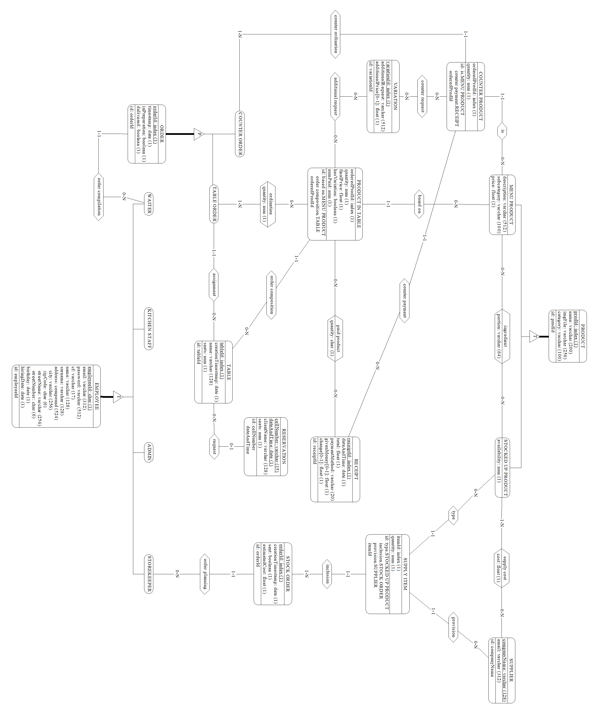

\newcommand{\bluerow}{\rowcolor{RoyalBlue!60}}
\newcommand{\lbluerow}{\rowcolor{RoyalBlue!40}}
\newcommand{\whiterow}{\rowcolor{white}}
\newcommand{\redrow}{\rowcolor{BrickRed!60}}
\newcommand{\lredrow}{\rowcolor{BrickRed!40}}
\newcommand{\llredrow}{\rowcolor{BrickRed!15}}
\newcommand{\und}[1]{\underline{#1}}
\newpage
\tableofcontents
\newpage

# Analisi dei requisiti

Si vuole realizzare un database a supporto dell'automazione della gestione di un esercizio commerciale attivo nella ristorazione (bar/ristoranti). Il databse dovrà quindi memorizzare le informazioni riguardanti i tavoli con le relative comande, prodotti e scontrini. I dipendenti del bar potrenno visualizzare le comande associate ai tavoli e compilare gli scontrini, mentre l'amministratore potrà visualizzare i dati relativi al fatturato.

## Intervista

Un primo testo ottenuto dall’intervista è il seguente:

Si vuole tenere traccia delle comande e della gestione del magazzino di un bar/ristorante memorizzandone i prodotti e le comande. Ogni prodotto è caratterizzato da un nome, una descrizione, un prezzo di vendita o, eventualmente, un prezzo di acquisto per la gestione del magazzino. 

Al momento della creazione di una comanda, vengono registrati i prodotti associati, la quantità di ciascun prodotto e il tavolo a cui la comanda è destinata. Ai tavoli è possibile attribuire un nome scelto al momento (ad esempio "Tavolo Sala 1" o "Tavolo Pippo").

Il sistema permette di redigere uno o più scontrini per ogni tavolo, consentendo di dividere la spesa tra più clienti se necessario. Gli scontrini riportano il prezzo di ogni prodotto e il totale della spesa. Si tenga presente che uno scontrino non si riferisce necessariamente ad un tavolo, un ordine può anche essere fettuato al tavolo e in quel caso necessita il pagamento al momento dell'ordine.

Il database mantiene uno storico di tutti i pagamenti riscossi, consentendo la generazione di grafici per monitorare il fatturato sia annuale che mensile, o l'andamento delle vendite di ciascun prodotto.

Il bar/ristorante dispone di uno o più amministratori con la possibilità di aggiungere nuovi utenti e visualizzare i dati sul fatturato. Gli utenti possono essere suddivisi nei seguenti ruoli:

- Camerieri: possono redigere le comande per i tavoli.
- Baristi/Cuochi: possono visualizzare le comande in arrivo e segnarle come pronte una volta preparate.
- Magazzinieri: possono stilare la lista dei prodotti presenti in magazzino, annotare i prodotti da ricomprare e gestire il loro prezzo di acquisto.

Ogni comanda viene registrata con la data e l'ora in cui è stata creata e può essere modificata solo da utenti autorizzati fino a quando non viene chiusa con l'emissione di uno scontrino.

Gli amministratori possono anche visualizzare report dettagliati che comprendono:

- Elenco dei prodotti più venduti.
- Analisi del fatturato su base giornaliera, settimanale, mensile e annuale.
- Analisi dei servizi effettuati: persone e tavoli serviti

In sintesi, il compito dello staff del bar/ristorante è assicurarsi che le comande vengano redatte e gestite correttamente, che i prodotti siano sempre disponibili in magazzino, e che le vendite e il fatturato vengano monitorati e analizzati per migliorare la gestione complessiva del locale.

\newpage

## Estrazione dei concetti principali

| \bluerow\ **Termine**  | **Breve descrizione**           | **Eventuali Sinonimi** |
|:-------------|:-----------------------------------------:|-------------------:|
| Prodotto     | Sono gli articoli venduti dall'esercizio, ognuno con un proprio costo |
| Tavolo       | Oggetto a cui è possibile attribuire un nome e una data, rappresenta il gruppo dei clienti a cui si riferiscono comande e scontrini | Clienti |
| Comanda      | Una comanda è un ordine effettuato in un qualsiasi momento dai clienti di un tavolo, contenente uno o più prodotti |
| Scontrino    | Oggetto in cui viene riportata una spesa effettuata da un tavolo, possono esserci uno o più scontrini associati ad un tavolo | Spesa |
| Cameriere    | Colui che compila comande e scontrini | Cassiere |
| Preparatore  | Colui che segna le comande come completate | Cuoco, Bartender |
| Magazziniere | Colui che segna la disponibilità dei prodotti nel magazzino |

## Elaborazione dei concetti principali

A seguito della lettura e comprensione dei requisiti si redige un testo che ne riassuma tutti i concetti, con particolare attenzione a quelli principali ed eliminando le ambiguità:

> Per ogni ***prodotto***[^1] nel menù vengono memorizzati _nome, descrizione, prezzo di vendita_, inoltre ogni prodotto possiede un _codice_ univoco assegnatogli quando viene aggiunto al menù. Se il prodotto è un semplice prodotto da magazzino allora deve riportare anche il proprio _costo_.  
> Ogni ***comanda*** possiede _data e ora_, può essere in preparazione o completata ed ha un _codice univoco_, le comande possono riguardare _ordini al banco_ oppure _ordini al tavolo_. Ad ogni comanda sono associati uno o più prodotti insieme alle _quantità_ richieste. Deve essere possibile verificare che tutti i prodotti appartenenti ad una comanda sono stati pagati.
> Un ***tavolo*** è caratterizzato da: _un codice univoco, un nome (scelto al momento della creazione), un numero di persone_ sedute al tavolo e _una data di creazione_.  
> Uno ***scontrino*** rappresenta la somma dei costi di uno o più prodotti presenti in una comanda associata ad una tavolo, l'insieme degli scontrini erogati in un tavolo rappresenta la spesa totale. Ogni scontrino ha un _codice univoco_ indipendente dal tavolo, _una data e un orario_, _una spesa_ e _una modalità di pagamento_[^2], per ogni scontrino deve essere possibile elencare i prodotti che lo componevano e le relative quantità.  
> Lo staff è composto da:

>   - ***amministratori***: hanno la possibilità di aggiungere membri dello staff e visualizzare info sulle vendite
>    - ***preparatori***: preparano le comande e le segnano come completate e aggiornano i prodotti in menu.
>    - ***magazzinieri***: ordinano prodotti del magazzino e ne segnano la disponibilità.
>    - ***camerieri***: aggiungono tavoli e compilano comande e scontrini.

[//]: #Footnotes

[^1]: Un prodotto può essenzialmente essere un prodotto preparato (es: un drink), un prodotto da magazzino (es: farina) oppure entrambi (es: bottiglia di vino).
[^2]: i.e. contante, bancomat...

Segue un elenco delle principali azioni richieste:

1. _Aggiornare prodotti_
2. _Aggiungere tavoli_
3. _Compilare comande_
4. _Mostrare le comande filtrate per stato e numerate in base all'ordine di arrivo in giornata_
5. _Mostare il numero di tavoli e clienti serviti in una sera_
6. _Visualizzare prodotti e relative variazioni appartenenti ad una comanda_
7. _Ricerca prodotti per similitudine di nome, categoria e sottocategoria_
8. _Visualizzare prodotti non pagati in un tavolo_
9. _Compilare scontrini di un tavolo_
10. _Visualizzare i guadagni in un dato periodo_
11. _Compilare ordini del magazzino_
12. _Visualizzare le spese per i rifornimenti in un dato periodo_
13. _Visualizzare le prenotazioni per un dato giorno_
14. _Visualizzare la ricetta di un prodotto_
15. _Aggiornare staff del locale_

\newpage
# Progettazione concettuale

## Schema Scheletro

L'entità ***prodotto*** viene identificata tramite un codice univoco, dall'analisi si evince che ne esistono due tipologie:

- prodotti da magazzino 
- prodotti in menu

 queste tipologie sono specializzazioni _sovrapponibili_ dell'entità prodotto. 

{height=300px}  

\newpage

Ogni comanda si riferisce ad un ***tavolo***, se ordinata da esso, altrimenti allo ***scontrino*** tramite cui è stata pagata, anch'essi identificati tramite un **codice univoco**. Ad ogni tavolo è possibile assegnare un **nome** e un **numero di clienti** seduti.

Uno stesso ***prodotto*** può presentarsi nella stessa ***comanda*** con **variazioni** e quantità differenti (si pensi ad esempio ad una stessa bevanda, nello stesso tavolo, ordinata allo stesso momento, una con ghiaccio, una senza).
E' quindi necessario reificare l'entità ***prodotto al tavolo***, identificata tramite un **id univoco** nel tavolo a cui si riferisce.

Ad ogni prodotto al tavolo è possibile associare una variazione ed una quantità associata alla comanda. Ogni prodotto del tavolo può essere presente una sola volta nella stessa comanda, perciò è possibile creare un'associazione con la comanda e l'attributo *quantità*. Tale associazione esprime il vincolo per il quale le stesse istanze di ordine e prodotto non possono presentarsi con molteplici quantità.

{width=700px}

\newpage
Le entità ***cameriere, preparatore, amministratore*** e ***magazziniere*** non sono altro che specializzazioni dell'entità ***persona*** (o dipendente), ognuna identificata tramite _codice fiscale_. 
Di ogni dipendente si vuole mantenere nel databse il ruolo all'interno del locale per conoscere le operazioni che possono effettuare (ad esempio la visualizzazione dei dati sul fatturato è un'operazione che spetta esclusivamente ad un amministratore). In particolare per ogni comanda e per ogni ordine di magazzino si vuole tenere nel database il cameriere e l'addetto al magazzino che li hanno compilati.

\newpage
Uno stesso ***prodotto*** può essere incluso in uno stesso ***ordine di magazzino***, identificato tramite un **codice univoco**, più volte, ordinato ad esempio da ***fornitori*** diversi, ognuno con un **prezzo** potenzialmente diverso per lo stesso prodotto. E' quindi necessario reificare l'entità di ***prodotto in ordine***, avente come attributi la quantità ordinata e un'associazione al fornitore scelto.

Dell'ordine di magazzino è inoltre necessario tenere traccia nel database della data e ora dell'ordine, se l'ordine è già stato inviato e il dipendente che lo ha compilato.

{width=660}

\newpage
Ogni ***prodotto al tavolo*** può essere pagato in più scontrini in quantità differenti e con modalità di pagamento differenti. E' necessario quindi reificare l'entità di ***prodotto pagato***, avente come attributo la ***quantità pagata***.

Ogni ***scontrino*** è identificato da un **codice univoco**, ha una **data e un orario**, una **spesa** e una **modalità di pagamento**. Uno scontrino, inoltre, può essere o meno collegato ad un tavolo, infatti un prodotto potrebbe anche essere consumato al banco ad esempio.

{width=660}

## Schema ER completo

Di seguito si allega lo schema ER nel suo complesso, importato su [DB-Main](www.db-main.eu).

\newpage
# Progettazione logica

## Stima del volume di dati

Di seguito la stima dei volumi richiesti per entità e relazioni:

[Tabella prod]: #Tabella prodotti

|\bluerow\ **Concetto**       | **Costrutto** | **Volume** |
|:----------------------------|:-------------:|-----------:|
| Menu Product                | E             | 80         |
| Stocked Up Product          | E             | 250        |
| Ingredient                  | R             | 320[^3]    |
| Variation                   | E             | 500        |
| customer choice             | R             | 480        |

[^3]: Considerando una media di 4 ingredienti per prodotto in menu 

[Tabella ordini]: #Tabella ordini, tavoli, scontrini e prenotazioni

|\bluerow\ **Concetto** | **Costrutto** | **Volume** |
|:----------------------|:-------------:|-----------:|
| Table                 | E             | 150.000    |
| Product In Table      | E             | 750.000[^4]|
| Customer Order        | E             | 300.000[^5]|
| ordination            | R             | 750.000    |
| based on              | R             | 750.000    |
| additional request    | R             | 750.000[^6]|
| Receipt               | E             | 300.000[^7]|
| Paid Product          | E             | 1.000.000[^8]|
| product payment       | R             | 1.000.000  |
| receipt composition   | R             | 1.000.000  |
| table payment         | R             | 300.000    |
| order composition     | R             | 750.000    | 
| assignment            | R             | 300.000    |
| order compilation     | R             | 300.000    |
| Reservation           | E             | 5.000      |
| request               | R             | 5.000      |

[^4]: Considerando circa 5 diversi prodotti ordinati in un tavolo
[^5]: Considerando circa 2 comande per tavolo
[^6]: Considerando che ogni prodotto ordinato presenta una variazione
[^7]: Considerando circa 2 scontrini per tavolo
[^8]: Considerando che per ogni prodotto al tavolo deve esistere almeno un corrispondente prodotto pagato e che alcuni potrebbero essere pagati in scontrini diversi

[Tabella magazzino]: #Tabella ordini di magazzino

|\bluerow\  **Concetto**       | **Costrutto** | **Volume** |
|:-----------------------------|:-------------:|-----------:|
| Supplier                     | E             | 10         |
| supply                       | R             | 750        |
| provision                    | R             | 10.000     |
| type                         | R             | 10.000     |
| Supply Item                  | E             | 10.000     |
| inclusion                    | R             | 10.000     |
| Stock Order                  | E             | 1.000      |

[//Tabella dipendenti]: #Tabella dei dipendenti

|\bluerow\ **Concetto**       | **Costrutto** | **Volume** |
|:----------------------------|:-------------:|-----------:|
| Waiter                      | E             | 25         |
| order compilation           | R             | 300.000    |
| Kitchen Staff               | E             | 25         |
| Admin                       | E             | 5          |
| Storekeeper                 | E             | 10         |
| order planning              | R             | 1.000      |

## Descrizione delle operazioni principali e stima della loro frequenza

Le operazioni da effettuare sono quelle precedentemente elencate nella fase di analisi. Di seguito vengono elencate insieme alla relativa frequenza:

|\bluerow\ **Numero operazione**  | **Operazione**                                              | **Frequenza**      |
|:--------------------------------|:------------------------------------------------------------|-------------------:|
| 1.                              | Aggiornare prodotti                                         | 50 all'anno        |
| 2.                              | Aggiungere tavoli                                           | 200 a settimana    |
| 3.                              | Compilare comande                                           | 800 a settimana    |
| 4.                              | Mostrare le comande filtrate per stato e numerate in base all'ordine di arrivo in giornata | 30 al giorno       |
| 5.                              | Mostare il numero di tavoli e clienti serviti in una sera   | 2 al giorno        |
| 6.                              | Visualizzare prodotti e relative variazioni in una comanda  | 10 al giorno       |
| 7.                              | Ricerca prodotti per similitudine di nome, categoria e sottocategoria | 4000 a settimana   |
| 8.                              | Visualizzare prodotti non pagati in un tavolo               | 2400 a settimana   |
| 9.                              | Compilare scontrini di un tavolo                            | 600 a settimana    |
| 10.                             | Visualizzare i guadagni in un dato periodo                  | 10 al mese         |
| 11.                             | Compilare ordini del magazzino                              | 3 a settimana      |
| 12.                             | Visualizzare le spese per i rifornimenti in un dato periodo | 10 al mese         |
| 13.                             | Visualizzare le prenotazioni per un dato giorno             | 100 a settimana    |
| 14.                             | Visualizzare la ricetta di un prodotto                      | 20 al giorno       |
| 15.                             | Aggiornare staff del locale                                 | 5 all'anno         |

## Schemi di navigazione e tabelle degli accessi

Sono riportate in seguito le tabelle degli accessi delle operazioni elencate sopra. Per il calcolo dei costi le operazioni in scrittura sono considerate con peso doppio rispetto a quelle in lettura.

### Operazione 1 - Aggiornare prodotti

L'aggiornamento di un _prodotto_ comporta anche l'aggiornamento della ricetta, possiamo considerare che in media ogni prodotto ha 3 _ingredienti_ e ogni _prodotto di magazzino_ è _ingrediente_ di 3 _prodotti da menù_.

| \bluerow\ **Concetto** | **Costrutto** | **Accessi** | **Tipo** |
|:----------------------:|:-------------:|:-----------:|---------:|
| Product                | E             | 1           | L        |
| Product                | E             | 1           | S        |
| Ingredient             | R             | 3           | L        |
| Ingredient             | R             | 3           | S        |
| \lbluerow              | **Totale:**   | 4S + 4L → 500 all'anno |

### Operazione 2 - Aggiungere Tavoli

| \bluerow\ **Concetto** | **Costrutto** | **Accessi** | **Tipo** |
|:----------------------:|:-------------:|:-----------:|---------:|
| Table                  | E             | 1           | S        |
| \lbluerow              | **Totale:**   | 1S → 400 a settimana   |

### Operazione 3 - Compilare Comande

La compilazione delle _comande_ richiede delle ricerche di _prodotti di menu_, che in media sono 3 a comanda, successivamente occorrono degli accessi in lettura alle _variazioni_, degli aggiornamenti nei _prodotti al tavolo_ e degli accessi in scrittura nelle _richieste aggiuntive_.

| \bluerow\ **Concetto** | **Costrutto** | **Accessi** | **Tipo** |
|:-----------------------|:-------------:|:-----------:|---------:|
| Menu Product           | E             | 3           | L        |
| Variation              | E             | 3           | L        |
| additional request     | R             | 3           | S        |
| Product In Table       | E             | 3           | L        |
| Product In Table       | E             | 3           | S        |
| ordination             | R             | 3           | S        |
| Customer Order         | E             | 1           | S        |
| \lbluerow              | **Totale:**   | 10S + 9L → 23.200 a settimana |

### Operazione 4 - Mostrare le comande non completate in ordine di arrivo

Considerando 3 prodotti per comanda bisogna accedere in lettura anche alle _ordinazioni_ per ricostruire l'intera comanda.

| \bluerow\ **Concetto** | **Costrutto** | **Accessi** | **Tipo** |
|:----------------------:|:-------------:|:-----------:|---------:|
| \whiterow\ Customer Order | E          | 1           | L        |
| ordination             | R             | 3           | L        
| \lbluerow              | **Totale:**   | 4L → 120 al giorno      |

### Operazione 5 - Mostrare il numero di tavoli e clienti serviti in una sera

| \bluerow\ **Concetto** | **Costrutto** | **Accessi** | **Tipo** |
|:----------------------:|:-------------:|:-----------:|---------:|
| \whiterow\ Table       | E             | 1           | L        |
| \lbluerow              | **Totale:**   | 1L → 2 al giorno       |

### Operazione 6 - Ricerca prodotti per categorie e sottocategorie

| \bluerow\ **Concetto** | **Costrutto** | **Accessi** | **Tipo** |
|:----------------------:|:-------------:|:-----------:|---------:|
| \whiterow\ Menu Product| E             | 1           | L        |
| Stocked Up Product     | E             | 1           | L        |
| \lbluerow              | **Totale:**   | 2L → 20 al giorno      |

### Operazione 7 - Ricerca prodotti per nome

| \bluerow\ **Concetto** | **Costrutto** | **Accessi** | **Tipo** |
|:----------------------:|:-------------:|:-----------:|---------:|
| \whiterow\ Menu Product| E             | 1           | L        |
| Stocked Up Product     | E             | 1           | L        |
| \lbluerow              | **Totale:**   | 2L → 8000 a settimana  |

### Operazione 8 - Visualizzare prodotti non pagati in un tavolo

Per visualizzare i prodotti non pagati è sufficiente accedere prima al _tavolo_ e successivamente ai _prodotti nel tavolo_, che in media in un _tavolo_ sono 5.

| \bluerow\ **Concetto** | **Costrutto** | **Accessi** | **Tipo** |
|:----------------------:|:-------------:|:-----------:|---------:|
| Table                  | E             | 1           | L        |
| Product In Table       | E             | 5           | L        |
| \lbluerow              | **Totale:**   | 6L → 14.400 a settimana|

### Operazione 9 - Compilare scontrini

Per compilare uno _scontrino_ è necessario innazitutto una visualizzazione dei prodotti non pagati in un tavolo. Successivamente bisogna aggiungere dei _prodotti pagati_, in media 3 per _scontrino_, e aggiornare l'attributo _numPaid_ nei relativi _prodotti ordinati_.

| \bluerow\ **Concetto** | **Costrutto** | **Accessi** | **Tipo** |
|:----------------------:|:-------------:|:-----------:|---------:|
| Receipt                | E             | 1           | S        |
| Table                  | E             | 1           | L        |
| Product In Table       | E             | 5           | L        |
| Paid Product           | E             | 3           | S        |
| Product In Table       | E             | 3           | S        |
| \lbluerow              | **Totale:**   | 7S + 8L → 13.200 a settimana |

### Operazione 10 - Visualizzare i guadagni in un dato periodo

E' sufficiente accedere ai dati dei pagamenti degli _scontrini_.

| \bluerow\ **Concetto** | **Costrutto** | **Accessi** | **Tipo** |
|:----------------------:|:-------------:|:-----------:|---------:|
| \whiterow\ Receipt     | E             | 1           | L        |
| \lbluerow              | **Totale:**   | 1L → 10 al mese        |

### Operazione 11 - Compilare gli ordini del magazzino

Per compilare un _ordine di magazzino_ è necessario accedere ai _prodotti di magazzino_, in media 20 per ordine, scegliere il _fornitore_, in media sono 4, confrontando il _costo_.
Occorre poi creare gli _elementi di fornitura_ con le quantità scelte.

| \bluerow\ **Concetto** | **Costrutto** | **Accessi** | **Tipo** |
|:----------------------:|:-------------:|:-----------:|---------:|
| Stocked Up Product     | E             | 20          | L        |
| supply                 | R             | 4           | L        |
| Supply Item            | E             | 20          | S        |
| Supply Item            | E             | 20          | L        |
| Stock Order            | E             | 1           | S        |
| \lbluerow              | **Totale:**   | 21S + 44L → 258 a settimana |

### Operazione 12 - Visualizzare le spese per i rifornimenti in un dato periodo

Considerando come riferimento una settimana[^9]:

[^9]: Ci si attiene alle stime fatte precedentemente, che erano su base settimanale. Il costo può essere moltiplicato per trovare la stima mensile e/o annuale.
[^10]: Se si volesse ottenere il costo di una lettura su base mensile fatta 3 volte a settimana il costo diventerebbe:  
        _Totale = 63L * 4 * 3 = 756 a settimana_

| \bluerow\ **Concetto** | **Costrutto** | **Accessi** | **Tipo** |
|:----------------------:|:-------------:|:-----------:|---------:|
| Stock Order            | E             | 3           | L        |
| Supply Item            | E             | 60          | L        |
| \lbluerow              | **Totale:**   | 63L[^10] →     189 a settimana |

### Operazione 13 - Visualizzare le prenotazioni per un dato giorno

Si possono considerare in media 5 prenotazioni al giorno, per ogni prenotazione si vuole visualizzare il _tavolo_ previsto se esiste.

| \bluerow\ **Concetto** | **Costrutto** | **Accessi** | **Tipo** |
|:----------------------:|:-------------:|:-----------:|---------:|
| Prenotation            | E             | 1           | L        |
| Table                  | E             | 1           | L        |
| \lbluerow              | **Totale:**   | 2L → 200 a settimana   |

### Operazione 14 - Visualizzare la ricetta di un prodotto

Per ogni _prodotto in menu_ consideriamo una media di 3 _ingredienti_, come già fatto in precedenza.

| \bluerow\ **Concetto** | **Costrutto** | **Accessi** | **Tipo** |
|:----------------------:|:-------------:|:-----------:|---------:|
| Menu Product           | E             | 1           | L        |
| Stocked Up Product     | E             | 3           | L        |
| ingredient             | R             | 3           | L        |
| \lbluerow              | **Totale:**   | 7L → 140 al giorno     |

### Operazione 15 - Aggiornare staff del locale

| \bluerow\ **Concetto** | **Costrutto** | **Accessi** | **Tipo** |
|:----------------------:|:-------------:|:-----------:|---------:|
| Employee               | E             | 1           | S        |
| \lbluerow              | **Totale:**   | 1S → 10 all'anno       |

## Riepilogo dei costi stimati per operazione

Di seguito viene stilata una tabella riassuntiva coi costi sopraelencati:

|\bluerow\ **Indice**             | **Operazione**                                              | **Frequenza**      | **Costo stimato** |
|:--------------------------------|:------------------------------------------------------------|:-------------------|:------------------|
| 1.                              | Aggiornare prodotti                                         | 50 all'anno        | 500 all'anno      |
| 2.                              | Aggiungere tavoli                                           | 200 a settimana    | 400 a settimana   |
| 3.                              | Compilare comande                                           | 800 a settimana    | 23.200 a settimana| 
| 4.                              | Mostrare le comande non completate in ordine di arrivo      | 30 al giorno       | 120 al girono     |
| 5.                              | Mostare il numero di tavoli e clienti serviti in una sera   | 2 al giorno        | 2 al giorno       |
| 6.                              | Ricerca prodotti per categorie e sottocategorie             | 10 al giorno       | 20 al giorno      |
| 7.                              | Ricerca prodotti per nome                                   | 4000 a settimana   | 8000 a settimana  |
| 8.                              | Visualizzare prodotti non pagati in un tavolo               | 2400 a settimana   | 14.400 a settimana|
| 9.                              | Compilare scontrini                                         | 600 a settimana    | 13.200 a settimana|
| 10.                             | Visualizzare i guadagni in un dato periodo                  | 10 al mese         | 10 al mese        |
| 11.                             | Compilare ordini del magazzino                              | 3 a settimana      | 258 a settimana   |
| 12.                             | Visualizzare le spese per i rifornimenti in un dato periodo | 10 al mese         | 189 a settimana   |
| 13.                             | Visualizzare le prenotazioni per un dato giorno             | 100 a settimana    | 200 a settimana   |
| 14.                             | Visualizzare la ricetta di un prodotto                      | 20 al giorno       | 140 al giorno     |
| 15.                             | Aggiornare staff del locale                                 | 5 all'anno         | 10 all'anno       |

## Raffinamento dello schema

### Eliminazione delle gerarchie

Per la gerarchia dei _dipendenti_, poiché la copertura è sovrapposta e le diverse specializzazioni non presentano attributi aggiuntivi, ma si configurano più come delle specie di permessi per effettuare determinate operazioni, si è scelto il collasso verso l'alto, aggiungendo all'entità _dipendente_ tanti attributi booleani quante sono le specializzazioni.

Per la gerarchia dei _prodotti_ si è invece scelto un collasso verso il basso, replicando gli attributi di _prodotto_ in _prodotto in menu_ e _prodotto in magazzino_. Si adotta questa strategia in quanto la ridondanza, essendo non esclusiva, è presente, ma effettivamente trascurabile. La quantità di prodotti che sono sia prodotti da magazzino che prodotti in menù è infatti scarsa (ad esempio bevande e pochi altri prodotti). Inoltre le operazioni svolte sui prodotti in menù vengono effettuate molto più spesso di quanto venga fatto per i prodotti in magazzino.

### Eliminazione attributi composti

Nello schema è presente l'attributo composto _indirizzo_ nell'entità _dipendente_. 
Tale attributo è stato diviso nelle sue sotto componenti, si renderà necessario poi, a livello applicativo, che tali valori siano impostati in modo coerente tra loro.

### Eliminazione degli identificatori esterni
Nello schema E/R sono eliminate le seguenti relazioni:

- **ingredient**: reificata importando _menuProdId_ da _Menu Product_ e _ingredientId_ da _Stocked Up Product_
- **based on**: eliminata importando _menuProdId_ da _Menu Product_ a _Product In Table_
- **is**: eliminata importando _menuProdId_ da _Menu Product_ a _Counter Product_
- **additional request**: reificata importando _menuProdId_ da _Menu Product_, _tableId_, _orderedProdId_ da _Product in Table_ e _variationId_ da _Variation_
- **counter request**: reificata importando _menuProdId_ da _Menu Product_, _orderedProdId_ da _Counter Product_, _receiptId_ e _variationId_
- **ordination**: reificata importando _menuProdId_ da _Menu Product_, _orderId_ da _Customer Order_, _orderedProdId_ da _Product In Table_ e _tableId_
- **counter ordination**: eliminata importando _orderId_ da _Counter Order_
- **counter payment**: eliminata importando _receiptId_ da _Receipt_
- **assignment**: eliminata importando _tableId_ in _Customer Order_
- **order composition**: eliminata importando _tableId_ in _Product in Table_
- **paid product**: reificata importando _orderedProdId_ da _Product In Table_, _menuProdId_ da _Menu Product_ e _tableId_
- **order compilation**: eliminata importando _waiterId_ da _Waiter_ a _Customer Order_ e _Counter Order_
- **request**: eliminata importando _tableId_ da _Table_ a _Reservation_
- **supply cost**: reificata importando _prodId_ da _Stocked Up Product_ e _supplierName_ da _Supplier_
- **type**: eliminata importando _prodId_ da _Stocked Up Product_ a _Supply Item_
- **provision**: eliminata importando _supplierName_ da _Supplier_ a _Supply Item_
- **inclusion**: eliminata importando _orderId_ da _Stock Order_ a _Supply Item_
- **order planning**: eliminata importando _storekeeperId_ da _Storekeeper_ a _Stock Order_

## Analisi delle ridondanze

Nell'entità _Product In Table_ gli attributi _numPaid_, _quantity_ e _finalPrice_ sono ridondanze. 
Tuttavia, a discapito di un piccolo overhead in termini di memoria si ha vantaggio nelle operazioni più eseguite, infatti:

- Per reperire _numPaid_ occorrerebbero, in media, 2 accessi in lettura a _Paid Product_
- Per ottenere _quantity_ occorrerebbero, in media, 2 accessi in lettura a _ordination_
- Per conoscere la quantità dei **non pagati** occorrerebbero quindi almeno 4 accessi in lettura in più ogni volta
- Per ottenere _final price_ occorrerebbe per _Product In Table_ un accesso in lettura a _Menu Product_, _additional request_ e _Variation_, quindi circa 3 accessi in lettura in più per prodotto considerando una sola variazione

> **Operazione 8:**

>> **con ridondanza**:

>> | \bluerow\ **Concetto** | **Costrutto** | **Accessi** | **Tipo** |
>> |:----------------------:|:-------------:|:-----------:|---------:|
>> | Table                  | E             | 1           | L        |
>> | Product In Table       | E             | 5           | L        |
>> | \lbluerow              | **Totale:**   | 6L → 14.400 a settimana|

    
>> **senza ridondanza**:

>> | \redrow\ **Concetto**  | **Costrutto** | **Accessi** | **Tipo** |
>> |:----------------------:|:-------------:|:-----------:|---------:|
>> | Table                  | E             | 1           | L        |
>> | \llredrow\ Product In Table | E        | 5           | L        |
>> | Paid Product           | E             | 10          | L        |
>> | \llredrow\ ordination  | E             | 10          | L        |
>> | \lredrow               | **Totale:**   | *26L → 62.400 a settimana* |

> **Operazione 9:**  
  
>> **con ridondanza**:

>> | \bluerow\ **Concetto** | **Costrutto** | **Accessi** | **Tipo** |
>> |:----------------------:|:-------------:|:-----------:|---------:|
>> | Receipt                | E             | 1           | S        |
>> | Table                  | E             | 1           | L        |
>> | Product In Table       | E             | 5           | L        |
>> | Paid Product           | E             | 3           | S        |
>> | Product In Table       | E             | 3           | S        |
>> | \lbluerow              | **Totale:**   | 7S + 8L → 13.200 a settimana |

>> **senza ridondanza**:

>> | \redrow\ **Concetto**  | **Costrutto** | **Accessi** | **Tipo** |
>> |:----------------------:|:-------------:|:-----------:|---------:|
>> | \llredrow\ Receipt     | E             | 1           | S        |
>> | Table                  | E             | 1           | L        |
>> | \llredrow\ Product In Table | E        | 5           | L        |
>> | Paid Product           | E             | 10          | L        |
>> | \llredrow\ ordination  | E             | 10          | L        |
>> | Paid Product           | E             | 3           | S        |
>> | \llredrow\ Variation   | E             | 3           | L        |
>> | additional request     | E             | 3           | L        |
>> | \lredrow               | **Totale:**   | *4S + 32L → 24.000 a settimana* |

Si può notare come in entrambe le operazioni più frequenti la ridondanza semplifichi di tanto il costo complessivo stimato.

## Traduzione di entità e associazioni in relazioni

- EMPLOYEES(\und{employeeId}, email, password, cf, name, surname, birthday, hiringDate, city, zipCode, streetName, isAdmine, isWaiter, isKitchenStaff, isStoreKeeper)

- MENU_PRODUCTS(\und{prodId}, name, imgFile, category, description, subcategory, price)

- STOCKED_UP_PRODUCTS(\und{prodId}, name, imgFile, category, subcategory, availability)

- INGREDIENTS(\und{menuProdId}, \und{ingredientId}, portion)

>> FK: menuProdId REFERENCES MENU_PRODUCTS  
>> FK: menuProdId REFERENCES MENU_PRODUCTS

- VARIATIONS(\und{variationId}, \und{menuProdId}, additionalRequest, additionalPrice*)

>> FK: menuProdId REFERENCES MENU_PRODUCTS

- TABLES(\und{tableId}, creationTimestamp, name, seats)

- RESERVATIONS(\und{cellNumber}, \und{dateAndTime}, clientName, seats, tableId*)

>> FK: tableId REFERENCES TABLES

- RECEIPTS(\und{receiptId}, dateAndTime, total, paymentMethod, givenMoney\*, change\*, tableId\*)

>> FK: tableId REFERENCES TABLES

- PRODUCTS_IN_TABLE(\und{orderedProdId}, \und{menuProdId}, \und{tableId}, quantity, finalPrice, hasVariations, numPaid)

>> FK: tableId REFERENCES TABLES  
>> FK: menuProdId REFERENCES MENU_PRODUCTS

- PAID_PRODUCTS(\und{orderedProdId}, \und{menuProdId}, \und{tableId}, \und{receiptId}, quantity)

>> FK: receiptId REFERENCES RECIPTS  
>> FK: (orderedProdId, menuProdId, tableId) REFERENCES PRODUCTS_IN_TABLE

- ADDITIONAL_REQUESTS(\und{variationId}, \und{tableId}, \und{orderedProdId}, \und{menuProdId})

>> FK: (variationId, menuProdId) REFERENCES VARIATIONS  
>> FK: (orderedProdId, menuProdId, tableId) REFERENCES PRODUCTS_IN_TABLE

- CUSTOMER_ORDERS(\und{orderNum}, \und{tableId}, timestamp, inPreparation, delivered, waiterId)

>> FK: tabledId REFERENCES TABLES  
>> FK: waiterId REFERENCES EMPLOYEES

- ORDINATIONS(\und{orderNum}, \und{menuProdId}, \und{tableId}, \und{orderedProdId}, quantity)

>> FK: (orderNum, tableId) REFERENCES CUSTOMER_ORDERS  
>> FK: (orderedProdId, menuProdId, tableId) REFERENCES PRODUCTS_IN_TABLE

- SUPPLIERS(\und{companyName}, email)

- SUPPLY_COSTS(\und{prodId}, \und{companyName}, cost)

>> FK: prodIs REFERENCES STOCKED_UP_PRODUCTS  
>> FK: companyName REFERENCES SUPPLIERS

- STOCK_ORDERS(\und{creationTimestamp}, sent, estimatedCost, storekeeperId)

>> FK: storekeeperId REFERENCES EMPLOYEES

- SUPPLY_ITEMS(\und{prodId}, \und{orderDate}, \und{supplierName}, quantity)

>> FK: supplierName REFERENCES SUPPLIERS  
>> FK: orderDate REFERENCES STOCK_ORDERS  
>> FK: prodId REFERENCES STOCKED_UP_PRODUCTS

