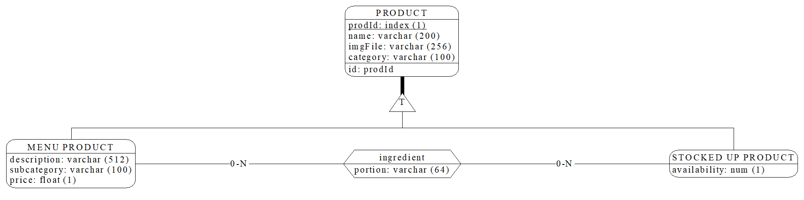

\newpage
\tableofcontents
\newpage

# Analisi dei requisiti

Si vuole realizzare un database a supporto dell'automazione della gestione di un esercizio commerciale attivo nella ristorazione (bar/ristoranti). Il databse dovrà quindi memorizzare le informazioni riguardanti i tavoli con le relative comande, prodotti e scontrini. I dipendenti del bar potrenno visualizzare le comande associate ai tavoli e compilare gli scontrini, mentre l'amministratore potrà visualizzare i dati relativi al fatturato.

## Intervista

Un primo testo ottenuto dall’intervista è il seguente:

Si vuole tenere traccia delle comande e della gestione del magazzino di un bar/ristorante memorizzandone i prodotti e le comande. Ogni prodotto è caratterizzato da un nome, una descrizione, un prezzo di vendita o, eventualmente, un prezzo di acquisto per la gestione del magazzino. 

Al momento della creazione di una comanda, vengono registrati i prodotti associati, la quantità di ciascun prodotto e il tavolo a cui la comanda è destinata. I tavoli possono essere identificati sia da un indice numerico sia da un nome scelto al momento (ad esempio "Tavolo 1" o "Tavolo Pippo").

Il sistema permette di redigere uno o più scontrini per ogni tavolo, consentendo di dividere la spesa tra più clienti se necessario. Gli scontrini riportano il prezzo di ogni prodotto e il totale della spesa. Si tenga presente che anche se in futuro si decidesse di eliminare con una certa periodicità lo storico dei tavoli serviti, gli scontrini non devono comunque essere eliminati.

Il database mantiene uno storico di tutti i pagamenti riscossi, consentendo la generazione di grafici per monitorare il fatturato sia annuale che mensile, o l'andamento delle vendite di ciascun prodotto. 

Il bar/ristorante dispone di uno o più amministratori con la possibilità di aggiungere nuovi utenti e visualizzare i dati sul fatturato. Gli utenti possono essere suddivisi nei seguenti ruoli:

- Camerieri: possono redigere le comande per i tavoli.
- Baristi/Cuochi: possono visualizzare le comande in arrivo e segnarle come pronte una volta preparate.
- Magazzinieri: possono stilare la lista dei prodotti presenti in magazzino, annotare i prodotti da ricomprare e gestire il loro prezzo di acquisto.

Ogni comanda viene registrata con la data e l'ora in cui è stata creata e può essere modificata solo da utenti autorizzati fino a quando non viene chiusa con l'emissione di uno scontrino.

Gli amministratori possono anche visualizzare report dettagliati che comprendono:

- Elenco dei prodotti più venduti.
- Analisi del fatturato su base giornaliera, settimanale, mensile e annuale.
- Monitoraggio delle scorte di magazzino, inclusi avvisi per i prodotti che stanno per terminare.

In sintesi, il compito dello staff del bar/ristorante è assicurarsi che le comande vengano redatte e gestite correttamente, che i prodotti siano sempre disponibili in magazzino, e che le vendite e il fatturato vengano monitorati e analizzati per migliorare la gestione complessiva del locale.

\newpage

## Estrazione dei concetti principali

| **Termine**  | **Breve descrizione** | **Eventuali Sinonimi** |
|:-------------|:---------------------:|-----------------------:|
| Prodotto     | Sono gli articoli venduti dall'esercizio, ognuno con un proprio costo |
| Tavolo       | Oggetto a cui è possibile attribuire un nome e una data, rappresenta il gruppo dei clienti a cui si riferiscono comande e scontrini | Clienti |
| Comanda      | Una comanda è un ordine effettuato in un qualsiasi momento dai clienti di un tavolo, contenente uno o più prodotti |
| Scontrino    | Oggetto in cui viene riportata una spesa effettuata da un tavolo, possono esserci uno o più scontrini associati ad un tavolo | Spesa |
| Cameriere    | Colui che compila comande e scontrini | Cassiere |
| Preparatore  | Colui che segna le comande come completate | Cuoco, Bartender |
| Magazziniere | Colui che segna la disponibilità dei prodotti nel magazzino |

## Elaborazione dei concetti principali

A seguito della lettura e comprensione dei requisiti si redige un testo che ne riassuma tutti i concetti, con particolare attenzione a quelli principali ed eliminando le ambiguità:

> Per ogni ***prodotto***[^1] nel menù vengono memorizzati _nome, descrizione, prezzo di vendita_, inoltre ogni prodotto possiede un _codice_ univoco assegnatogli quando viene aggiunto al menù. Se il prodotto è un semplice prodotto da magazzino allora deve riportare anche il proprio _costo_.  
> Ogni ***comanda*** possiede _data e ora_, può essere in preparazione o completata ed ha un _codice univoco_ all'interno del tavolo a cui è collegata. Ad ogni comanda sono associati uno o più prodotti insieme alle _quantità_ richieste. Deve essere possibile verificare che tutti i prodotti appartenenti ad una comanda sono stati pagati.
> Un ***tavolo*** è caratterizzato da: _un codice univoco, un nome (scelto al momento della creazione), un numero di persone_ sedute al tavolo e _una data di creazione_.  
> Uno ***scontrino*** rappresenta la somma dei costi di uno o più prodotti presenti in una comanda associata ad una tavolo, l'insieme degli scontrini erogati in un tavolo rappresenta la spesa totale. Ogni scontrino ha un _codice univoco_ indipendente dal tavolo, _una data e un orario_, _una spesa_ e _una modalità di pagamento_[^2].  
> Lo staff è composto da:

>   - ***amministratori***: hanno la possibilità di aggiungere membri dello staff e visualizzare info sulle vendite
>    - ***preparatori***: preparano le comande e le segnano come completate e aggiornano i prodotti in menu.
>    - ***magazzinieri***: ordinano prodotti del magazzino e ne segnano la disponibilità.
>    - ***camerieri***: aggiungono tavoli e compilano comande e scontrini.

[//]: #Footnotes

[^1]: Un prodotto può essenzialmente essere un prodotto preparato (es: un drink), un prodotto da magazzino (es: farina) oppure entrambi (es: bottiglia di vino).
[^2]: i.e. contante, bancomat...

Segue un elenco delle principali azioni richieste:

1. Aggiungere prodotti
2. Aggiungere tavoli
3. Compilare comande
4. Mostrare le comande non completate in ordine di arrivo
5. Mostare il numero di tavoli e clienti serviti in una sera
6. Visualizzare prodotti per categorie e sottocategorie
7. Visualizzare prodotti non pagati in un tavolo
8. Compilare scontrini
9. Visualizzare i guadagni in un dato periodo
10. Compilare ordini
11. Visualizzare i costi dei rifornimenti in un dato periodo
12. Registrare staff del locale

\newpage
# Progettazione concettuale

## Schema Scheletro

L'entità ***prodotto*** viene identificata tramite un codice univoco, dall'analisi si evince che ne esistono due tipologie:

- prodotti da magazzino 
- prodotti in menu

 queste tipologie sono specializzazioni _sovrapponibili_ dell'entità prodotto. 

{width=600px}

\newpage
Uno stesso ***prodotto*** può presentarsi nella stessa ***comanda*** con richieste  e quantità differenti (si pensi ad esempio ad una stessa bevanda, nello stesso tavolo, ordinata allo stesso momento, una con ghiaccio, una senza).
E' quindi necessario reificare l'entità _prodotto in comanda_, identificata tramite un ordine nella comanda e il codice della comanda.

Ad ogni comanda corrisponde un ***tavolo***, identificato anch'esso tramite un _codice univoco_. Ad ogni tavolo è possibile assegnare un _nome_ e un _numero di clienti_ seduti.

{width=700px}

\newpage

Le entità ***cameriere, preparatore, amministratore*** e ***magazziniere*** non sono altro che specializzazioni dell'entità ***persona*** (o dipendente), ognuna identificata tramite _codice fiscale_. 
Di ogni dipendente si vuole mantenere nel databse il ruolo all'interno del locale per conoscere le operazioni che possono effettuare (ad esempio la visualizzazione dei dati sul fatturato è un'operazione che spetta esclusivamente ad un amministratore). In particolare per ogni comanda si vuole tenere nel database il cameriere che l'ha compilata.

{width=700}

\newpage
Uno stesso ***prodotto*** può presentarsi in uno stesso ***ordine*** al più una volta, perciò la relazione di _ordinazione_ possiede l'attributo _quantità_ esprimendo il vincolo per il quale le stesse istanze di ordine e prodotto non possono presentarsi con molteplici quantità, creando confusione nell'ordine. Per la _disponibilità_ in magazzino del prodotto si è aggiunto un semplice attributo alla specializzazione ***prodotto in magazzino***.

{width=660}

\newpage
Di seguito si allega lo schema ER nel suo complesso, importato su [DB-Main](www.db-main.eu).

